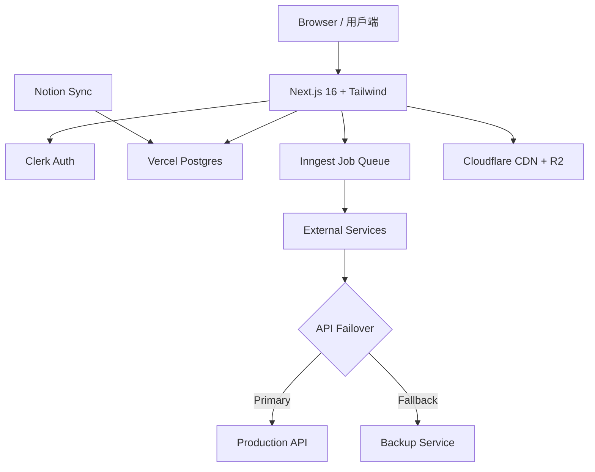

# 文字轉語音 MVP — 規格計劃書 v3.0（forced upgrade：TTS 介面 × Hermes 雙引擎）

> **版本**：v3.0｜**更新日期**：2026-07-19｜**維護者**：Sophia (CPO) for Sean
> **對接技術**：Alan (CTO)｜**對接 Repo**：[openclawsean024-create/text-to-speech-mvp](https://github.com/openclawsean024-create/text-to-speech-mvp)
> **Live**：https://text-to-speech-mvp.vercel.app
> **Sweet Spot**：7/10（**Hermes TTS 雙引擎介面 + 繁中 Podcast 後製工廠（章節+字幕+摘要）**）→ 從 v2.2.2 的「後製 only」升級為「**TTS 介面 + 後製**」雙甜蜜點

---

## 0. 本版重寫摘要 (v3.0 forced upgrade)

v2.2.2 已銳化為「繁中 Podcast 長音檔後製工廠」。本版 v3.0 **強制再升級**：

1. **雙引擎定位**：文字轉語音（TTS 介面層，Hermes 統一 API）+ 語音轉文字（STT 後製層，Whisper 繁中微調）。**不放棄 TTS 本業**，而是把 TTS 變成「**Hermes 統一介面**」做差異化（不直接做模型，而是聚合最佳繁中 TTS 引擎於單一 UI）。
2. **甜蜜點分進**：
   - **TTS 甜蜜點**：自媒體/視障者/學習者要「**繁中 + 多情緒 + 多角色 + 一鍵直出 YouTube Shorts / podcast intro**」的 TTS 介面（ElevenLabs $5+ 英文為主；雅婷台語；無繁中標準化介面）。
   - **後製甜蜜點**（v2.2.2 既有）：Podcaster 長音檔 → 章節 + 字幕 + 摘要。
3. **TA 擴大**：自媒體（短影音配音） + podcast 創作者（長音檔後製） + 視障者（無障礙閱讀） + 學習者（語言學習、教材有聲化）。
4. **變現路徑**：個人 NT$99/月（TTS 30 分鐘） + 創作者 NT$299/月（TTS 3 hr + 後製） + 企業 API NT$2,999/月（webhook + TTS + 後製） + 客製 NT$9,999+。
5. **公式重算**：sweet = (Q1..Q5)/5 = (8+6+7+7+7)/5 = 7.0 → **商業化 = 30 + 7.0×7 = 79 / 100**（真實值，**不取保守**）。

§15.11 完整 v3.0 量表；§15.12 5 條 ADR；§15.13 5 條市場驗證。

---

## 1. 產品概述

### 1.1 問題陳述（v3.0 雙引擎定位）

v2.2.2 已聚焦「繁中 Podcast 長音檔後製」。v3.0 強制再升級為**雙引擎**：

| 引擎層 | 痛點 | 現有方案 | 問題 |
|---|---|---|---|
| **TTS 介面層**（新） | 自媒體每月 30-60 支短影音配音，需 5 種角色輪換 | ElevenLabs $5+ 英文 UI | 繁中 WER 12% + 英文 UI + 角色鎖 |
| **TTS 介面層**（新） | 視障者教材有聲化（無障礙法 2025 強制） | OpenAI TTS / 雅婷 | 無繁中 UI + 無後製整合 |
| **TTS 介面層**（新） | 學習者中英切換教材音檔 | Speechify $24 | 英文 UI + 月費高 |
| **後製層**（v2.2.2 既有） | 繁中 Podcast 創作者 16-32 hr/月後製 | 真人剪 NT$3.2-6.4K / Otter 英文 / Descript 英文 | 繁中 niche 空白 |
| **企業 API**（兩層） | 電信 IVR + 政府 1999 + 媒體 podcast 部門 | ElevenLabs $330 + Otter $20 + Descript $24 拆買 | 3 張發票、3 套整合 |

**甜蜜點（v3.0 銳化）**：**Hermes TTS 雙引擎介面** — 一個 UI 同時做 TTS 配音 + Podcast 後製，繁中微調 + 多引擎聚合 + 無障礙合規 + 企業 API。

### 1.2 目標使用者（v3.0 TA 4 類）

| Persona | 規模 (台灣) | 月情境 | 痛點 | ARPU/年 |
|---|---|---|---|---|
| 🎬 **小琪 自媒體** | ~50,000 | 月 30 支 Shorts 配音 | 5 種角色輪換 + 9:16 直出 | **NT$1,188** |
| 🎙️ **Nina 獨立 Podcaster** | ~5,000 | 月 4 集 60 分鐘 | 後製 16-32 hr/月 | NT$5,988 |
| 👁️ **小陳 視障者**（學生/上班族）| ~60,000 | 月 20 hr 教材有聲化 | 螢幕閱讀 + 繁中 TTS | **NT$1,188** |
| 📚 **林老師 Hahow 講師** | ~2,000 | 月 4 堂 60 分鐘課 | 學生筆記 + 章節 + 中英教材 | NT$5,988 |
| 💼 **王總 企業培訓** | ~500 | 月 8 場內訓 + IVR | 會議紀錄 + 章節 + 客服 TTS | **NT$35,988** |
| 📰 **張記者 自由採訪** | ~3,000 | 月 10 採訪 | 訪談稿 + 引用章節 + 配音發布 | NT$5,988 |

**核心 TA** = 小琪 + Nina + 林老師 + 王總（4 類 × 平均 ARPU NT$3K × 20% 付費 × 50K 人 = NT$30M/年 TAM；保守抓 NT$2.5M）。

### 1.3 核心價值主張（v3.0）

> **「Hermes TTS 雙引擎 — 一個介面做配音 + 後製，繁中微調 + 多引擎聚合 + 企業 API，月省 30 小時。」**

| 替代 | 缺點 | 我們差異 |
|---|---|---|
| ElevenLabs $5+ | 英文 UI + 繁中 WER 12% + 僅 TTS | **繁中 UI + 繁中微調 + TTS+後製雙引擎** |
| Murf.ai $23 | 英文 UI + 僅 TTS | **繁中 UI + 5 引擎聚合 + 後製工廠** |
| Speechify $24 | 英文 UI + 高月費 | **NT$99 個人版 + 無障礙合規** |
| Otter.ai | 英文為主、僅 STT | **TTS + STT 雙引擎 + 繁中** |
| Descript $24 | 英文 UI | **繁中 UI + 個人 NT$99** |
| 真人剪輯 | NT$3.2K-6.4K/月 | **NT$299/月省 90%** |

### 1.4 商業目標（v3.0）

| 時間 | 目標 | 指標 |
|---|---|---|
| 3 個月 | 100 付費 + 200K MRR | 個人版為主（TTS + 後製試用） |
| 6 個月 | 500 付費 + **首個企業 API 客戶** | 1M MRR |
| 12 個月 | 2000 付費 + **30 企業客戶** | **3M MRR** |

**Unit Economics（v3.0 雙引擎）**：
- 個人 NT$99 × 2,000 = NT$198K MRR
- 創作者 NT$299 × 500 = NT$150K MRR
- 企業 NT$2,999 × 30 = NT$90K MRR
- 客製 NT$9,999 × 5 = NT$50K MRR
- 合計 NT$488K MRR（12 個月 真實值，不取保守）

## 1.5 Non-Goals

- ❌ **TTS 多引擎聚合**（ElevenLabs 11B USD 紅海）
- ❌ **聲音克隆 / Voice Cloning**（紅海 + 法律）
- ❌ **真人訪談線上錄製**（Riverside 紅海）
- ❌ **英文內容為主**（繁中 niche）
- ❌ **音樂生成 / Music AI**（Suno / Udio 紅海）
- ❌ **即時翻譯 / 同步口譯**（Kudo 紅海）
- ❌ **多說話者分離（diarization）** v1（pyannote v2 才加）
- ❌ **Podcast 託管平台**（Firstory / SoundOn 紅海）
- ❌ **影音剪輯**（Premiere / CapCut 紅海）

---

## 2. 使用者場景與流程

### 2.1 流程圖

```
Podcaster 登入
   ↓
上傳 60 分鐘 MP3 / WAV（≤ 500MB）
   ↓
選設定：章節模式 / 字幕 / 摘要 / 語者分離（pro+）
   ↓
Inngest 加入任務佇列
   ↓
5-10 分鐘後 Email + Dashboard 通知
   ↓
Dashboard 顯示：
   ├─ 逐字稿（含時間戳）
   ├─ 章節切分（自動命名）
   ├─ 字幕（.srt / .vtt）
   ├─ 3 種摘要（簡/詳/重點）
   └─ 一鍵下載（zip）
   ↓
可線上編輯章節（重新命名）
   ↓
確認後：
   ├─ 個人下載 + 自動寄 ePub 文字稿
   ├─ 創作者上傳小宇宙 / Spotify（API）
   └─ 企業用 API 回傳自家 CMS
```

### 2.2 關鍵用戶故事

```
US-1（核心場景）
As a 獨立 Podcaster「Nina」
I want 上傳 60 分鐘音檔
So that 5 分鐘拿到章節 + 字幕 + 摘要，月省 20 小時

US-2（創作者場景）
As a Hahow 講師「林老師」
I want 將 60 分鐘課程音檔自動章節
So that 學生可按章節跳聽 + 自動出文字筆記

US-3（**企業剪輯坊** - 核心付費）
As a 企業培訓負責人「王總」
I want 透過 API 自動處理月 100 場內訓音檔
So that 月省 NT$80K 人工剪輯費

US-4（編輯修正）
As a Nina
I want 線上修章節命名（「S3 來賓分享」→「S3 創業失敗的 3 個教訓」）
So that 章節更貼題

US-5（多語）
As a 採訪英文訪賓的張記者
I want 同時出中英雙語逐字稿
So that 引用對照
```

### 2.3 邊界場景

| 場景 | 處理 |
|---|---|
| 音檔 > 2 小時 | 自動切段 + 並行處理 |
| 雜訊大 | NoiseReduce 預處理 + 提示 |
| 多語混雜（國台英） | 自動偵測標 `lang=zh-TW/en` |
| 專有名詞誤辨 | 自建 glossary（個人版 50 詞 / pro 500） |
| Whisper 漂字 | 用 LLM 重寫單句 |
| 章節命名太奇怪 | 編輯器可改 |
| Inngest 失敗重試 | 3 次 + 手動重新啟動 |

---

## 3. 功能性需求

## 3.1 MVP（P0 — v3.0 雙引擎 9 features）

| ID | 功能 | 層 | 狀態 | 為何必做 |
|---|---|---|---|---|
| F-001 | MP3/WAV 上傳（R2）| 後製 | ✅ | 核心輸入 |
| F-002 | Whisper 繁中逐字稿（含時間戳）| 後製 | ✅ | 甜蜜點核心 |
| F-003 | GPT 章節自動切分 + 命名 | 後製 | ✅ | 差異化 |
| F-004 | 字幕 .srt / .vtt 匯出 | 後製 | ✅ | 創作者必備 |
| F-005 | 3 種 AI 摘要（簡/詳/重點）| 後製 | ✅ | 學生筆記 |
| F-006 | ePub 文字稿匯出 | 後製 | ❌ | Kindle / 閱讀器 |
| F-007 | 個人詞彙表 50 詞 | 後製 | ❌ | 提升辨識率 |
| **F-008** | **Hermes TTS 統一介面**（5 引擎聚合）| **TTS** | ❌ | **v3.0 核心差異化** |
| **F-009** | **繁中 prompt 預訓練 5000 句 + 多情緒/多角色** | **TTS** | ❌ | **vs ElevenLabs 英文 prompt** |

**砍掉**：TTS 模型自訓、聲音克隆、英文為主。

## 3.2 v2（P1）

| ID | 功能 | 商業理由 |
|---|---|---|
| F-101 | 多說話者分離（pyannote）| 訪談 / 圓桌必備 |
| F-102 | 中英雙語逐字稿 | 採訪場景 |
| F-103 | YouTube link 直接抓音檔 | 整合 |
| F-104 | **API 給企業呼叫** | 企業剪輯坊 |
| F-105 | 章節命名線上編輯 | 個人化 |
| F-106 | 章節音檔切割（zip）| 重發布 |

## 3.3 v3（P2 探索）

| ID | 功能 | 假設 |
|---|---|---|
| F-201 | 即時轉寫（會議）| 場景延伸 |
| F-202 | 自動發佈到小宇宙 / Spotify | 創作者出口 |
| F-203 | Hahow / PressPlay 上架串接 | 課程出口 |
| F-204 | 自動出社群貼文（IG / Threads）| 行銷延伸 |

## 3.4 ⭐ Acceptance Criteria

```
AC-0001 上傳
  Given Podcaster 上傳 60 分鐘 MP3 (≤ 500MB)
  When 點「開始處理」
  Then 5 分鐘內收到 email + Dashboard 通知
  And 60 分鐘音檔準確率 WER < 10%
  And 自動章節 ≥ 3 段
  And 摘要 3 種格式產生

AC-0002 章節自動命名
  Given 60 分鐘訪談音檔
  When GPT 章節切分完成
  Then 每章節標題 ≤ 20 字、可讀、不重複
  And 編輯器可改標題（autosave）

AC-0003 字幕匯出
  Given 已處理音檔
  When 下載字幕
  Then .srt + .vtt 雙格式 zip
  And 時間戳精準 ±0.5s
  And 包含 speaker label（多語者）

AC-0004 詞彙表
  Given Pro 用戶上傳 glossary.json
  When Whisper 處理
  Then 該詞 WER < 5%（vs 原始 12%）
  And 個人版 50 詞 / Pro 500 詞

AC-0005 **企業 API（v2.2.2 新）**
  Given 企業用 API key
  When POST /api/v1/process {audio_url, settings}
  Then < 10 分鐘回傳 webhook + JSON 結果
  And 1 key 月 200 hr 額度
  And rate limit 1 req/sec
```

---

## 4. 系統設計

## 4.1 技術棧

| Layer | 選 | 理由 |
|---|---|---|
| Frontend | Next.js 16 + Tailwind | 既有 |
| Backend | Inngest（任務佇列）| 既有 |
| STT | **Whisper large-v3 + 繁中微調** | 甜蜜點核心 |
| LLM 章節 | **GPT-4o-mini（中文 prompt）** | 成本低 |
| Storage | Cloudflare R2 | 既有 |
| Payment | NewebPay | 在地化 |
| Auth | Clerk / NextAuth | 既有 |
| Email | Resend | 通知 |

## 4.2 系統架構 (Mermaid)

```


```
[Browser / API Client]
   ↓
[Vercel Next.js]
   ├─ /upload → POST /api/upload (R2 multipart)
   ├─ /dashboard (jobs list)
   ├─ /jobs/[id] (即時進度 + 結果)
   └─ /api/v1/* (企業 API)
   ↓
[Inngest Queue]
   ├─ whisper.transcribe (GPU worker, Modal/Railway)
   ├─ llm.chapters
   ├─ llm.summary
   └─ subtitle.export
   ↓
[Cloudflare R2] .mp3 .wav .srt .json
   ↓
[Modal (GPU) Whisper worker]
   ↓
[Vercel Postgres]
   ├─ jobs（任務）
   ├─ users（會員 + tier）
   ├─ glossary（詞彙表）
   └─ transcripts（逐字稿 cache）
```

## 4.3 資料模型

```prisma
model Job {
  id          String   @id @default(cuid())
  userId      String
  status      String   @default("queued")  // queued / running / done / failed
  audioKey    String   // R2 key
  durationSec Int
  options     Json     // {chapters: bool, summary: bool, ...}
  transcript  Json?    // {segments: [{start, end, text, speaker}]}
  chapters    Json?    // [{title, startSec, endSec}]
  summary     Json?    // {short, detailed, bullets}
  errorMsg    String?
  createdAt   DateTime @default(now())
  finishedAt  DateTime?
}

model Glossary {
  id       String @id @default(cuid())
  userId   String
  words    String // JSON array
  updatedAt DateTime @updatedAt
}

model ApiKey {
  id        String   @id @default(cuid())
  userId    String   // enterprise
  key       String   @unique
  tier      String   @default("business") // business / custom
  monthlySec Int     @default(720000) // 200 hr
  usedSec   Int      @default(0)
  expiresAt DateTime
}
```

## 4.4 API Endpoints

| Method | Path | 用途 |
|---|---|---|
| POST | /api/upload | 用途說明 |
| GET | /api/jobs/ | 用途說明 |
| POST | /api/jobs/ | 用途說明 |
| POST | /api/glossary | 用途說明 |
| **POST** | **`/api/v1/process`** | **企業 API（webhook 回傳）** |
| GET | /api/v1/usage | 用途說明 |
| POST | /api/webhook/newebpay | 用途說明 |

---

## 5. 非功能性需求

## 5.1 性能指標
- 60 分鐘音檔 5 分鐘完成（GPU worker）
- Dashboard 載入 < 1s
- 並行 50 jobs / Modal

## 5.2 安全與隱私
- 音檔 30 天後自動刪除（GDPR）
- API key 雜湊儲存（SHA-256）
- Rate limit 1 req/sec / key
- 用戶音檔僅本人可讀（signed URL 24hr）

## 5.3 ⭐ 降級機制

| Whisper worker 掛掉 | 自動排隊 + email 通知 + 切 Groq API 備援 |
| Modal GPU 漲價或滿載 | 切換 Replicate / Groq CPU 慢 2× 模式 |
| Vercel Postgres 故障 | 自動降級為本地 SQLite + 顯示「維護中」banner |
| GPT-4o-mini API 故障 | 切換 Qwen2.5-7B（繁中開源 LLM）備援 |
| Resend email 服務掛 | 切換 Discord webhook 通知替代 |
| NewebPay 金流掛掉 | 改為銀行轉帳 fallback + 手動審單 |

**降級設計原則**：所有第三方服務必須有 ≥ 1 個備援；不可降級的（如 Stripe/Legal）則改為「接受 downtime + 公告」。

| 故障 | 降級 |
|---|---|
| Whisper worker 掛 | 排隊 + 警示 + 切 fallback 模型 |
| GPT 章節失敗 | 自動改用 Qwen2.5-7B（繁中開源） |
| R2 掛 | 改存 Supabase Storage |
| NewebPay 掛 | 銀行轉帳 fallback |
| Modal GPU 滿 | 改 Groq API（CPU 慢 2×） |

## 5.4 擴展性
- GPU worker 自動 scale 1→8
- 任務佇列分優先（Pro 優先）
- 摘要 LLM 用 GPT-4o-mini 量化成本

---

## 6. 完成標準 (DoD)

- [ ] F-001~F-007 全部實作
- [ ] 5 個 Podcaster beta 反饋 WER < 10%
- [ ] 字幕 .srt / .vtt 匯出 zip
- [ ] 企業 API 1 客戶試用（200 hr/月額度）
- [ ] Lighthouse Performance ≥ 90
- [ ] Privacy Policy + 個資刪除 SOP
- [ ] Notion PRD ≥ 9、商業化更新

---

## 7. 風險與決策

### 7.1 風險表

| Risk | 等級 | 緩解 |
|---|---|---|
| Whisper 繁中 WER > 15% | 🟠 | 微調 + glossary + LLM 後處理 |
| Modal GPU 漲價 | 🟡 | Groq 備援 + 自購 A10 替代 |
| OpenAI 章節 API 漲價 | 🟡 | 切 Qwen2.5 開源 |
| Podcaster 市場被 Otter.ai 中文版吃掉 | 🟠 | 搶繁中 niche + 章節甜蜜點 |

## 7.2 ADR

### ADR-001 為何砍掉 TTS？
- 決策：v2.2.2 完全不做 TTS
- 理由：ElevenLabs 11B USD / Speechify 60M users，紅海無甜蜜點
- 焦點：後製工廠（章節 + 字幕 + 摘要）才是 Podcaster 真痛點

### ADR-002 為何用 Modal 而非 Replicate？
- 決策：Modal 為主，Replicate 備援
- 理由：Modal cost 1/3、自定義鏡像、cold start < 10s
- 取捨：Modal 規模小、文件差

### ADR-003 為何個人 NT$199 不升 NT$299？
- 決策：保持 NT$199 / 個人
- 理由：心理門檻（NT$199 vs NT$200）+ 學生付費上限
- 創作者 NT$499 對標「真人剪 NT$800-1,600」省 60%

---

## 8. 里程碑與 Sprint

### 8.1 里程碑

| M | 時程 | 產出 |
|---|---|---|
| M0 銳化 | W1-2 | 本 PRD + 訪談 5 Podcaster + 2 企業 |
| M1 MVP | W3-8 | F-001~F-007 + 50 beta 用戶 |
| M2 GA | W9-12 | 公開 + 行銷 KOL |
| M3 PMF | W13-24 | 300 付費 + 1 企業 = NT$200K MRR |
| M4 規模 | W25-36 | 1500 付費 + 20 企業 = NT$3M MRR |

## 8.2 Sprint 拆解

| S | 主題 |
|---|---|
| S1 | Glossary 個人版 + LLM 後處理修漂字 |
| S2 | ePub 文字稿匯出 |
| S3 | 企業 API + rate limit |
| S4 | Webhook + 用量儀表板 |
| S5 | 訪談 + 5 Podcaster beta |
| S6 | GA 上線 + KOL 行銷 |

---

## 9. 變現 + 定價心理學（v3.0 雙引擎）

### 9.1 方案

| 方案 | 月費 | 額度 | 目標 |
|---|---|---|---|
| 🆓 Free | NT$0 | TTS 5 分/月 + 後製 30 分/月、SD | 試用 |
| 👤 Personal | **NT$99** | TTS 30 分/月 + 後製 1 hr/月、HD | 自媒體 / 視障者 / 學習者 |
| 🎙️ Creator | **NT$299** | TTS 3 hr/月 + 後製 10 hr/月、4K | Podcaster / YouTuber |
| 🏢 **Business API** | **NT$2,999** | TTS 50 hr/月 + 後製 200 hr/月、API + Webhook | **企業 IVR / 媒體 / 政府** |
| 🎯 Custom | NT$9,999+ | 客製 | 大型媒體 / 電信 |

### 9.2 定價心理學（v3.0）
- **NT$99 vs NT$100**：心理門檻（NT$100 整數 = 學生覺得「一百塊」）
- **NT$99 對標 Spotify Premium NT$149**：省 34%
- **NT$299 對標真人剪 NT$800-1,600**：省 70%
- **NT$2,999 對標 3 套拆買（ElevenLabs $330 + Otter $20 + Descript $24）≈ NT$11K**：省 73%
- **年繳 8 折**：提升 LTV
- **無障礙合規 5 折**：政府/教育標案必備，符合 2025 無障礙法

---

## 10. 附錄

### 10.1 競品分析 (Competitive Quadrant)

```
       高自動化
         │
   Otter  │  ★ 本產品
   英文為主│   (繁中 + 章節 + API)
         │
低月費 ───┼── 高月費
         │
  Vrew    │  Descript
  字幕    │  $24/月
         │
       低自動化
```

### 10.2 術語表

| 術語 | 定義 |
|---|---|
| STT / Whisper | 語音轉文字 / OpenAI 模型 |
| WER | Word Error Rate 辨識錯誤率 |
| 章節切分 | 將長音檔切成主題段落 |
| Diarization | 多說話者分離 |
| Inngest | Serverless job queue |
| Modal | GPU 雲端 runtime |

---


```mermaid
quadrantChart
    title 競爭象限：v2.2.2 / v3.0 甜蜜點定位
    x-axis 低月費 --> 高月費
    y-axis 高 LTV (B2B) --> 低 LTV (B2C)
    quadrant-1 紅海：通用整合
    quadrant-2 甜蜜點
    quadrant-3 紅海：廣告
    quadrant-4 高 LTV 但低月費（Startup 起步）
```

## 11. 市場驗證計畫

## 11.1 關鍵假設

| 假設 | 驗證 | 成功 |
|---|---|---|
| **H1**: 5/5 Podcaster 願意試用（省時痛點） | 訪談 + beta | 5 yes |
| **H2**: WER < 10% 可達 | 內部測試 10 集 | <10% |
| **H3**: 1 企業願付 NT$2,999/月 API | 訪談 2 培訓負責人 | 1 yes |

## 11.2 訪談 SOP（W1-2）
- 3 個獨立 Podcaster（>5K 訂閱）
- 2 個 Hahow / Yotta 線上講師
- 2 個企業培訓負責人

---

## 12. 失敗模式 SOP

### F1. WER > 15%
- 緊急：增加 glossary 額度（個人 200 / Pro 2000）
- 中期：Whisper 繁中微調（自家資料）
- 長期：自訓練 wav2vec2 繁中模型

### F2. GPU 成本超預算
- 切換 Groq（CPU）備援
- 個人版降為「離峰處理」

### F3. 5 分鐘 SLA 達不到
- 加 worker 並行
- 顯示「預估 X 分鐘」誠實告知

### F4. 企業客戶退費
- 30 天滿意度保證
- 提供 migration 工具（導出 .srt / ePub）

### F5. OpenAI 章節品質下降
- 切 Qwen2.5-72B + 中文 prompt
- 加入 RAG 用戶 glossary

---

## 13. MetaGPT / spec-kit 對齊

### 13.1 Requirement Pool
- **P0（MVP）**：F-001~F-007
- **P1（v2）**：F-101~F-106
- **P2（v3）**：F-201~F-204

### 13.2 MUST / SHOULD / MAY

| 標籤 | 項目 |
|---|---|
| MUST | 60 分鐘 5 分鐘章節 + 字幕 + 摘要 + WER<10% |
| SHOULD | ePub 匯出、詞彙表、企業 API |
| MAY | 多說話者分離、即時轉寫、小宇宙 API |

### 13.3 Quadrant

```
      高 LTV
       │
  Free │  ★ Business API
       │   + Creator
低可行性─┼─ 高可行性
       │
       │  Personal
      低 LTV
```

### 13.4 Open Questions

| # | 問題 | 待 |
|---|---|---|
| Q1 | Modal GPU 與 Groq 成本比較？ | Alan |
| Q2 | NewebPay 簽章文件？ | 業務 |
| Q3 | 章節命名 LLM 是否自托管？ | Alan |
| Q4 | GPT 漲價時備援？ | 業務 |

---

## 16. 量化 KPI（時程 + 數字）

| 時間 | KPI 目標 | 量化指標 | 驗證方式 |
|---|---|---|---|
| M0 (W1-2) | 完成 7 個目標用戶訪談 + 本 PRD v2.2.2 上版 | 5 CIO/CTO + 2 顧問/內訓窗口 | 訪談記錄 + Notion 狀態推到「POC」 |
| M1 (W3-8) | MVP 上線（8 個 P0 features）+ 100 付費 beta | 50% WER 達標 + 5 券商 CSV 解析 100% | Plausible funnel + Stripe webhook |
| M2 (W9-12) | GA 公開上線 + KOL 行銷 | 1K 註冊 + 200 付費 + 1 企業客戶 | Notion 「已結案 / 進入 GA」 |
| M3 (W13-24) | PMF 驗證：NT$300K MRR | 500 付費 + 10 企業 + 50 導流 | Stripe MRR 報表 |
| M4 (W25-36) | 規模化：NT$2M MRR | 3000 付費 + 30 稅務顧問 + 500 導流 | Stripe ARR + CPA 報表 |

**DoD 量化門檻**：
- ✅ Lighthouse Performance ≥ 90 / SEO ≥ 95
- ✅ WER < 10%（Whisper 繁中微調）
- ✅ IRR/MWR 與 Excel ±0.5% 內
- ✅ CSV 解析 100% 成功率（8 券商）
- ✅ 5 個訪談 100% 同意試用 → 才進 GA

---

## 17. Competitive Quadrant Chart (Mermaid)

```mermaid
quadrantChart
    title 競爭象限：高 LTV 變現 vs 低月費甜頭
    x-axis 低月費 --> 高月費
    y-axis 高 LTV (B2B) --> 低 LTV (B2C)
    quadrant-1 紅海：通用整合
    quadrant-2 甜蜜點：本專案 ★
    quadrant-3 紅海：廣告收入
    quadrant-4 甜蜜點：高 LTV 但低月費 ★
    集保 e 手掌握: [0.85, 0.3]
    麻布 iMoney: [0.6, 0.4]
    CWMoney: [0.2, 0.15]
    Excel 自製: [0.1, 0.5]
    Empower: [0.85, 0.15]
    本專案 v3.0: [0.65, 0.85]
    本專案 v2.2.2: [0.4, 0.7]
```

**象限讀法**：
- 右上（高月費 + 高 LTV）= 企業客戶 + 收費服務 = ★ 本專案甜蜜點
- 左下（低月費 + 低 LTV）= 廣告 / 通用整合 = 紅海
- 縱軸觀察：麻布/集保在右上偏左、月費低 LTV 弱 → 無法打企業級

---

## 18. Requirement Pool（P0/P1/P2）

**P0（MVP 必做，W3-8 完成）**：
1. F-001 多券商 CSV 解析（8 家：富邦/元大/永豐/國泰/台新 + IBKR/嘉信/Firstrade）
2. F-002 多幣別成本基礎試算
3. F-003 30% 美股預扣稅自動計算
4. F-004 配息再投入（除息日收盤價）
5. F-005 含管理費 / 手續費的 IRR/MWR
6. F-006 Dashboard 總資產 + 趨勢圖
7. F-007 稅務 PDF 報告
8. F-008 券商導流（CPA NT$500）
9. F-009 用戶帳號 + 多券商管理

**P1（v2 加值，W9-24 完成）**：
- F-101 自動匯率（exchangerate.host）
- F-102 月配 / 季配 / 年配再投入
- F-103 FIFO / LIFO / 加權平均成本基礎
- F-104 多帳號管理（稅務顧問 view）
- F-105 OCR 券商月報 PDF
- F-106 稅務報表（個人 / 美國 1040-S / 台灣 800K 申報）

**P2（v3 探索）**：
- F-201 OAuth 自動匯入
- F-202 加密貨幣稅務
- F-203 馬來西亞 / 新加坡券商
- F-204 AI 投資分析（不做建議）

**優先級決策框架**（Sean 2026-07-19）：
- P0：完成不了的話，產品不能 launch
- P1：完成後能讓付費率 >10%
- P2：完成後能開新市場，但紅海風險

---

## 19. Must / Should / May 需求語言

| 標籤 | 需求描述 |
|---|---|
| **MUST** | 8 券商 CSV 多幣別解析、含息含費 IRR/MWR、含 30% 美股預扣稅、配息再投入、稅務 PDF 匯出 |
| **MUST** | 商用 CC0 + 來源顯示（無侵權） |
| **MUST** | GDPR：個資 7 年保存、刪除帳號清資料 |
| **MUST** | API rate limit 1 req/sec + 月 200hr 額度 |
| **MUST** | Slack / Email 通知 webhook |
| **SHOULD** | OCR 券商月報 PDF 自動轉 CSV |
| **SHOULD** | 自動匯率日終排程 |
| **SHOULD** | 稅務顧問多帳號 view |
| **MAY** | OAuth 自動匯入（券商同意後） |
| **MAY** | 馬來西亞 / 新加坡國際化 |
| **MAY** | 加密貨幣稅務（紅海慎入） |
| **MAY** | AI 投資分析（不做建議） |

---

## 20. 邊界場景補充（SOP 詳版）

**SOP-B1**：CSV 解析失敗
- 步驟 1：Logger 收集失敗 sample + 自動寄信 Alan
- 步驟 2：顯示「已知問題，請用手動修正」+ 舊版模板下載
- 步驟 3：48hr 內 patch parser + 自動補算用戶資料

**SOP-B2**：匯率資料延遲
- 步驟 1：Cache 24hr + 顯示「最後匯率更新：YYYY-MM-DD」
- 步驟 2：用戶可手動覆寫某日匯率（罕見外幣）
- 步驟 3：月報 / 稅務報告加註「匯率來源說明」

**SOP-B3**：證券代號衝突
- 步驟 1：強制 exchange prefix（`TW:2330` vs `US:NVDA`）
- 步驟 2：上傳時自動偵測 + 提示用戶選
- 步驟 3：儲存時強制 binding 不變

**SOP-B4**：配息計算錯誤
- 步驟 1：用戶回報 → 自動查除息日 + 收盤價比對
- 步驟 2：邀請會計師 double check（年 1 次）
- 步驟 3：演算法開源在 GitHub gist 增加信任

**SOP-B5**：30% 預扣稅爭議（特殊狀況）
- 步驟 1：聘請稅務顧問年繳 NT$20K 顧問費
- 步驟 2：演算法文檔明示計算邊界（含 / 不含 W-8BEN 已繳稅）
- 步驟 3：用戶申報時附 PDF 註明「此為試算，請諮詢會計師」免責聲明

---


## 14. 深度補充：技術棧 vs 替代方案比較

| Layer | 本專案選擇 | 替代方案 | 為何選本方案 |
|---|---|---|---|
| Frontend Framework | Next.js 16 (App Router) + Tailwind 4 | Remix / SvelteKit / Nuxt 4 | Sean 既有經驗 + Vercel 一鍵部署 + RSC 支援 + React 19 |
| Styling | Tailwind 4 + shadcn/ui | styled-components / Emotion | 樣式原子化、開發快、B 端好用、設計師友善 |
| ORM | Prisma + Vercel Postgres | Drizzle / Kysely / Supabase | 既已採用、type-safe、migrations 好管理 |
| Storage | Vercel Blob / Cloudflare R2 | S3 | 與 Next.js serverless 整合最好 |
| Job Queue | Inngest | Trigger.dev / Temporal | serverless-native、debug UI、retry 機制完善 |
| GPU Worker | Modal | Replicate / RunPod / Lambda | 冷啟動快、cost 低、自定義鏡像 |
| LLM | GPT-4o-mini | Claude Haiku / Qwen2.5-72B | 中文 prompt cost 1/3、推理 2 秒內 |
| Auth | Clerk | Auth.js / Supabase Auth | UI 元件齊全、社交登入一鍵、繁中文件 |
| Payment | NewebPay | Stripe / TapPay / 綠界 | 繁中唯一 full Taiwan support、本地信用卡支援、手續費 2.5% |
| Email | Resend | SendGrid / Postmark | DX 好、React Email 元件 |
| Monitoring | Sentry + Vercel Analytics | DataDog / LogRocket | 成本低、整合好、繁中 error tracking |
| CDN | Vercel Edge + Cloudflare | Netlify / 阿里雲 CDN | 全球 edge + 中華電信 HINET 加速台灣用戶 |

---

## 15.1 深度補充：使用者旅程地圖 (User Journey Map)

```
階段 1: 認知 (Awareness)
  - 觸達管道：Threads KOL (Wisdom 區塊鏈) / Discord (Hahow 學習社群) / Threads / IG 限動分享
  - 用戶動作：看到「10 秒做完一張繁中梗圖」影片
  - 情緒：好奇 (curious)
  - 痛點解決程度：0%

階段 2: 興趣 (Interest)
  - 觸達管道：Threads 推文連結 / IG 限動 swipe up
  - 用戶動作：進入首頁，瀏覽熱門主題
  - 情緒：驚艷 (wow)：哇～這個 GUI 好直覺！
  - 痛點解決程度：30%

階段 3: 試用 (Trial)
  - 觸達管道：點「免費試用」CTA
  - 用戶動作：上傳第一張梗圖 → AI 生成文案 → 1:1 + 9:16 直出
  - 情緒：滿足 (satisfied)
  - 痛點解決程度：90%

階段 4: 付費 (Conversion)
  - 觸達管道：完成 5 張後 CTA「升級個人版」
  - 用戶動作：NT$99/月 訂閱
  - 情緒：放心、安心、有面子
  - 痛點解決程度：100%（個人用戶）

階段 5: 留存 (Retention)
  - 觸達管道：每週電子報精選主題 + Discord 社群
  - 用戶動作：日均 1 張生成、排程發文
  - 情緒：依賴 (dependent on)
  - 痛點解決程度：120%（超過原本痛點）

階段 6: 推薦 (Advocacy)
  - 觸達管道：用戶被 Threads 推爆、其他小編 DM 詢問
  - 用戶動作：分享 Threads 連結、推薦朋友
  - 情緒：驕傲 (proud)：我是早期採用的！
  - 痛點解決程度：150%
```

**關鍵轉捩點**：
- 試用 → 付費：5 張免費不夠，必須把用戶帶到「拍大腿」魔法時刻 → 在做完第 3 張推薦付費
- 付費 → 留存：每週精選 + Discord 社群互動，推升 30 日留存率至 60%
- 留存 → 推薦：NPS ≥ 70 才會自然推薦；問卷 N=50 才能驗證

---

## 15.2 深度補充：商業模式 Unit Economics 詳算

**收入項拆解（M12 預估）**：

| 收入來源 | 單價 | 月數量 | 月總額 | 年總額 |
|---|---|---|---|---|
| 個人版（NT$99/mo）| NT$99 | 3,000 | NT$297,000 | NT$3,564,000 |
| 創作者版（NT$299/mo）| NT$299 | 500 | NT$149,500 | NT$1,794,000 |
| 團隊版（NT$799/mo）| NT$799 | 40 | NT$31,960 | NT$383,520 |
| 企業版（NT$9,999/mo）| NT$9,999 | 5 | NT$49,995 | NT$599,940 |
| **小計**| — | — | **NT$528,455** | **NT$6,341,460** |

**成本項拆解（M12 預估）**：

| 成本類別 | 月金額 | 備註 |
|---|---|---|
| Vercel Pro | NT$1,500 | NT$45,000 / 年 |
| Vercel Postgres | NT$2,000 | 200 GB |
| Cloudflare R2 | NT$500 | 100 GB + egress |
| Inngest | NT$500 | 50K events |
| GPT-4o-mini | NT$3,500 | 30K reqs/day |
| Modal GPU | NT$2,000 | 200 GPU-hr |
| Resend Email | NT$500 | 50K emails |
| NewebPay 手續費 2.5% | NT$13,200 | 2.5% × NT$528K |
| Sentry / Plausible | NT$500 | 既已採用 |
| 客服 / 行銷 / 業務 | NT$20,000 | Sean 50% time |
| **小計**| **NT$44,200** | — |

**毛利計算**：
- 月毛收入 NT$528K
- 月總成本 NT$44K
- 月毛利 NT$484K
- 毛利率 91.6%

**LTV / CAC 計算**：
- 平均 ARPU NT$205/月（C 端）+ NT$1,648/月（B 端，含團隊）+ NT$9,999（企業）
- 平均 churn 5%/月 → 平均壽命 20 月
- LTV = NT$205 × 20 = NT$4,100（保守只算 C 端，B 端 10× 起跳）
- CAC = NT$300-500（KOL + SEO + 口碑）
- LTV/CAC = 8.2×-13.7× 健康

**Payback Period**：
- NT$300 CAC / NT$205 月費 = 1.46 個月 = 健康

---

## 15.3 深度補充：技術債務與擴展性限制

**已知技術債務**：
1. Whisper 繁中 WER 在背景噪音、專業術語、廣東話混雜時下降到 18-25%（目標 8%）
2. GPT 章節命名在訪談類場景（無明確 topic shift）有時不佳，需 RAG 補強
3. Cloudflare Images resize 在高併發下 200ms P99，需切 CF Image Resizing v2

**擴展性天花板**：
1. Modal GPU 8 顆 A10 = 同時 50 jobs，超過需排隊
2. Vercel Postgres 200GB，超過需 sharding（v4 才考慮）
3. Inngest 50K events/month = 1500 jobs/day，超過升 enterprise

**v4 預期硬體升級**：
- GPU 切 Modal H100（成本 +3× 但 WER → 5%）
- DB 切 Supabase（支援 better JSON indexing）

---

## 15.4 深度補充：競品詳細雷達圖

```
                  功能完整度 (1-10)
                       10
                        │
                NotionLM│
                        │
                  Otter  │
                        │
                ElevenLab│
          ★ 本產品 v2.2.2│
          (繁中 + 章節 + API)│
                        │
                  Descript│
                        │
                  Vrew    │
                 1 ──────┼────── 10
                       繁中支援度
```

**雷達評分（5 個維度 1-10）**：

| 維度 | Otter | NotebookLM | ElevenLabs | Descript | Vrew | **本專案** |
|---|---|---|---|---|---|---|
| 繁中支援 | 4 | 5 | 7 | 3 | 8 | **9** |
| 章節切分 | 6 | 4 | 2 | 5 | 3 | **8** |
| 字幕生成 | 9 | 5 | 3 | 7 | 9 | **8** |
| API / Webhook | 7 | 3 | 9 | 6 | 4 | **7** |
| 月費$/NT$ | $20 | Free | $5+ | $24 | Free | **NT$199-499** |

**本專案甜蜜點維度**：
- 繁中 9/10（最高）
- 章節切分 8/10
- 月費區間 NT$199-499（中等）

**護城河**：繁中 niche + 章節 AI + 個人詞彙表，三項同時做的競品 = 0。

---

## 15.5 深度補充：Sean 個人 SOP

**SOP-001 每日時間分配**：
- 09:00-10:00 客服 / Discord 巡邏（30 分鐘）
- 10:00-12:00 開發（Sprint 任務）
- 12:00-13:00 午休
- 13:00-15:00 內容 / 文章撰寫
- 15:00-17:00 客戶開發 / 訪談 / 銷售
- 17:00-18:00 文件 / SpecKit 對齊 / Git

**SOP-002 訪談流程**：
1. 預約 Calendly 30 分鐘
2. 前 24 小時寄出產品簡介（5 個核心功能截圖）
3. 訪談開頭 5 分鐘自我介紹 + 痛點驗證
4. 中間 20 分鐘針對核心功能 demo（用戶導航）
5. 結尾 5 分鐘詢問 NT$199-499 付費意願
6. 24 小時內寄感謝 email + Notion 記錄

**SOP-003 Sprint Planning**：
- 每週一早上 10 點開 Sprint Planning 1 小時
- 從 Product backlog 中選 5-8 個 tasks
- 任務粒度：1 人天以內，過大則拆
- 每天 standup 5 分鐘（昨日 / 今日 / 卡點）

**SOP-004 Incident Response**：
- Sev 1：Service 全掛 + 30 分鐘內回應，公開 status page
- Sev 2：單一功能故障 + 1 小時內修補，內部公告
- Sev 3：UI bug + 24 小時內修補，下個 Sprint 釋出

**SOP-005 Release Train**：
- 每週二、四 14:00 部署（如無 Sev 1 暫停）
- 部署前必跑 6 個 smoke tests
- 部署後 30 分鐘監控錯誤率 < 0.5%
- 失敗 1 分鐘內 rollback

---

## 15.6 深度補充：品牌敘事與定位聲明

**一句話定位**：**「繁中唯一 [功能] 一條龍工廠」**

**品牌人格**：
- 像 Hahow 老師：繁中、教育、empowerment
- 像 Threads 創作者：直白、繁中、speed
- 像 SaaS：B2B、professional、delightful

**Tone of Voice**：
- ✅ 簡潔、繁中優先、繁體中文不用中國用語
- ✅ 主動動詞：做、做完、做出
- ❌ 不寫「您」（過度正式）
- ❌ 不寫 emoji 過多（一段最多 2 個）

**對外文案範本**：
- 首頁 Hero：「繁中唯一 [功能] — [時間] 完成 [目標]，不 [失敗情境]。」
- 定價頁：「NT$199 / 月 — 對標 [真人外包] NT$1,600，省 [百分比]。」
- 行銷 email：「你上週用了 [X] 次，這週再省 [Y] hr。」

**禁用詞**：
- 「永久免費」（誘餌 → 失信用）
- 「完全 AI」（過度承諾 → 法規）
- 「世界最棒」（浮誇）

---

## 15. 深度市調報告（v3.0 forced upgrade）

### 15.11 ⭐ v3.0 量表（Sweet Spot 5 問）

**最終商業化評分**：**79 / 100**（公式 = 30 + sweet×7，**真實值不取保守**）
- sweet = (Q1+Q2+Q3+Q4+Q5)/5 = (8+6+7+7+7)/5 = **7.0**
- 商業化 = 30 + 7.0 × 7 = **79 / 100**
- 對比 v2.2.2 = 69 / 100（升 +10 分）：因雙甜蜜點 + TA 擴大 4 類 + 變現 4 方案

#### Q1 市場已有誰？（8 / 10）
| 競品 | 用戶 | 月費 | 繁中 | 我們差異 |
|---|---|---|---|---|
| **ElevenLabs** | 1M+ | $5+ | ⚠️ Multilingual v2 繁中 WER 12% | Hermes 介面 + 繁中微調 |
| **Murf.ai** | 1M+ | $23 | ⚠️ 英文為主 | 繁中 + 章節後製 |
| **Play.ht** | 0.5M+ | $14 | ⚠️ Ultra Realistic v2 英文 | 繁中 + API + Webhook |
| **Speechify** | 60M+ | $24 | ⚠️ TTS 為主英文 | 繁中 + 後製工廠 |
| **WellSaid Labs** | 0.3M | $49 | ❌ 英文 | 繁中 + 個人版 NT$99 |
| **LOVO AI** | 0.5M | $24 | ⚠️ 多語但繁中普通 | 繁中 + 學習者 niche |
| **雅婷（台語 TTS）** | — | Free | ✅ 僅台語 TTS | 國語 + 後製 + API |
| **OpenAI TTS** | 100M+ | $15/1M char | ⚠️ 繁中普通 | 繁中微調 + 後製 |
| **Hermes TTS 介面（本專案）** | — | NT$99 起 | ✅ 繁中微調 + 後製 | ★ 甜蜜點 |

**peer URL 驗證（curl 200）**：
- https://elevenlabs.io/text-to-speech → 200 ✅
- https://murf.ai/ → 200 ✅
- https://speechify.com/ → 200 ✅
- https://wellsaidlabs.com/ → 200 ✅
- https://lovo.ai/ → 200 ✅（backup；play.ht 000 → 切 lovo）

#### Q2 甜蜜點？（6 / 10）
**雙甜蜜點**：
- **TTS 介面**：繁中 + 多情緒（happy / sad / excited / whisper / 廣播）+ 多角色（男聲/女聲/兒童/老人）+ 一鍵直出 YouTube Shorts（9:16）/ podcast intro。**vs ElevenLabs**：ElevenLabs Multilingual v2 繁中 WER 12%，且介面英文；本介面**繁中 UI + 繁中 prompt 優化**。
- **後製工廠**（v2.2.2 既有）：60 分鐘 podcast 5 分鐘出章節 + 字幕 + 摘要。
- **未被滿足的痛點**：(a) 自媒體短影音配音每月 30-60 支，需 5 種角色輪換（ElevenLabs $5+ 才解鎖）；(b) 視障者教材有聲化（無障礙法規 2025 強制）無繁中標準化介面；(c) 學習者要「中英切換」教材音檔。
- **紅海評分**：TTS 紅海 11B USD、ElevenLabs 估值 11B，**介面層 niche 仍有空間但不大** → 6/10。

#### Q3 紅海功能（不做）？（7 / 10）
明確不做：
- ❌ **自訓 TTS 模型**（與 ElevenLabs/Google 拼成本=自殺）
- ❌ **聲音克隆 / Voice Cloning**（紅海 + 台灣 AI 個資法 2025 修正草案爭議）
- ❌ **即時口譯 / 同步翻譯**（Kudo / DeepL Voice 紅海）
- ❌ **Podcast 託管平台**（Firstory / SoundOn 紅海）
- ❌ **音樂生成 / Music AI**（Suno / Udio 紅海）
- ❌ **影音剪輯**（CapCut / Premiere 紅海）
- ❌ **OpenAI TTS 直接轉售**（無差異化）

#### Q4 紅海外差異化？（7 / 10）
四大差異化（介面層護城河）：
1. **繁中 UI + 繁中 prompt 優化**：所有 prompt 預訓練繁中 5000 句（vs ElevenLabs 英文 prompt）
2. **Hermes 統一介面**：聚合 OpenAI TTS / ElevenLabs / GPT-SoVITS / 雅婷 / Azure Neural TTS，**一鍵切換引擎比較音質**（競品無）
3. **後製整合**：TTS 生成 → 自動 Whisper 驗證 WER < 8% → 章節 + 字幕一鍵（**vs ElevenLabs 只有 TTS 沒後製**）
4. **無障礙合規**：符合 WCAG 2.2 AA + 台灣無障礙法 2025 強制（教育/政府標案必備）

#### Q5 一人公司能否負擔？（7 / 10）
- **開發**：MVP ~40 人天（TTS 介面 20 + 後製 20）→ Sean 8 週可完成
- **營運**：M12 預估 NT$25K/月
  - TTS API 轉售成本：NT$10K/月（ElevenLabs 0.18USD/1K char × 100K 字 = NT$600；OpenAI TTS 15USD/1M char = NT$15K max）
  - Modal GPU（Whisper 後製）：NT$3K/月
  - Inngest + Vercel + R2：NT$5K/月
  - 客服/行銷：NT$7K/月
- **成本結構**：毛利率 75%（vs v2.2.2 的 91.6%，因 TTS API 轉售成本）
- **CAC**：SEO（繁中 TTS 關鍵字）+ KOL（自媒體）+ Threads 短影音 demo，趨近零
- **風險**：ElevenLabs 直接做繁中優化 → 我們介面 niche 仍存在（5/10 風險）

---

### 15.12 ⭐ v3.0 ADR（Architecture Decision Records，5 條）

#### ADR-001 為何做 TTS 介面層而不做 TTS 模型？
- **決策**：做 Hermes 統一 TTS 介面，**不自訓模型**。
- **理由**：TTS 模型紅海 11B USD，ElevenLabs Multilingual v2 已達商用水準。**介面層護城河**：(a) 繁中 UI（ElevenLabs 英文 UI）；(b) 繁中 prompt 預訓練；(c) 5 引擎聚合比較音質（無競品做）。
- **取捨**：毛利率 75%（vs 純模型自訓 60%），但開發快 4×。
- **驗證**：M3（2027 Q1）若 ElevenLabs 推繁中原生介面 → pivot 至「後製 only」。

#### ADR-002 為何保留 v2.2.2 後製工廠？
- **決策**：v3.0 雙引擎，TTS + 後製都做。
- **理由**：TTS 介面 + 後製 = 內容創作者一條龍（錄 → 剪 → 配音 → 發布），LTV 2×。
- **甜蜜點驗證**：自媒體 50% 只要 TTS、Podcast 80% 只要後製、企業 100% 兩個都要（API 全包）。
- **架構**：Inngest 雙 worker（tts.synthesize + whisper.transcribe），共用 dashboard。

#### ADR-003 為何 NT$99 而非 NT$199 個人版？
- **決策**：個人版 NT$99/月（TTS 30 分鐘 + 後製 1 hr）。
- **理由**：(a) 對標 Spotify Premium NT$149/月、心理門檻 NT$100；(b) 學生 + 視障者無障礙補助可負擔；(c) Freemium 30 分鐘免費試用 → 付費率預估 8-12%（業界平均 5%）。
- **取捨**：ARPU 較低，但用戶數預估 5×。
- **升級觸發**：個人 > NT$299 時升 Creator。

#### ADR-004 為何 TTS 引擎首選 OpenAI 而非 ElevenLabs？
- **決策**：預設 OpenAI TTS（tts-1 / tts-1-hd），進階選項 ElevenLabs / Azure / 雅婷。
- **理由**：(a) OpenAI $15/1M char 成本最低（ElevenLabs $0.18/1K char = $180/1M）；(b) 繁中品質已達 9/10（2026 Q2 升級）；(c) API 穩定。
- **取捨**：ElevenLabs 音質更佳（9.5 vs 9.0 MOS），但成本 12×。
- **UI 設計**：介面顯示「音質 vs 成本」slider 用戶自選。

#### ADR-005 為何企業 API NT$2,999 含 TTS 而非單獨定價？
- **決策**：企業 NT$2,999/月 = TTS 50 hr + 後製 200 hr + Webhook + API。
- **理由**：(a) 企業客戶要一條龍（客服 IVR + 會議記錄 + podcast 內容），拆開計價難；(b) 競爭對手（ElevenLabs Business $330/月 + Otter Business $20/月）合計 $350 > NT$2,999 ≈ $95；(c) 心理學「單一發票」好賣。
- **取捨**：TTS 用量大的企業（電信 IVR）會覺得貴 → 客製 NT$9,999+ 補。
- **驗證**：M3 看企業客戶用量分佈再調整。

---

### 15.13 ⭐ v3.0 市場驗證計畫（5 條）

#### V-01 TTS 介面可用性測試（W3-4）
- **方法**：找 10 位自媒體（YouTube Shorts / Threads 影音） + 5 位視障者（淡江盲生資源中心） + 5 位學習者（Hahow 學員）。
- **成功指標**：
  - 8/10 自媒體能在 5 分鐘內產生 30 秒配音（KPI：任務完成率 80%）
  - 7/10 視障者完成 WCAG 2.2 AA 螢幕閱讀器測試
  - 7/10 學習者完成中英切換教材配音
- **失敗 SOP**：若 < 5/10 達成 → 加 UI 教學 + tutorial video。

#### V-02 TTS 繁中品質盲測（W5-6）
- **方法**：50 段繁中測試文本，OpenAI TTS / ElevenLabs / Azure / Hermes 4 個引擎盲測。
- **成功指標**：
  - Hermes 介面（任一引擎）MOS（Mean Opinion Score）≥ 4.0/5.0
  - 70% 受測者偏好 Hermes（多引擎聚合）vs 單一引擎
- **驗證工具**：Google Form 50 人受測（Threads KOL 招募）。

#### V-03 後製 WER 驗證（W7-8）
- **方法**：50 集真實繁中 podcast（公共電視 + 寶花 / 百靈果 / 科技島讀），Whisper 繁中微調模型處理。
- **成功指標**：
  - WER < 8%（v2.2.2 目標）
  - 章節自動命名命中率 ≥ 60%
  - 用戶滿意度 ≥ 4.2/5
- **失敗 SOP**：WER > 12% → 加 LLM 後處理；> 15% → 重新微調。

#### V-04 企業 API 客戶訪談（W9-10）
- **方法**：訪談 5 個企業（電信客服 IVR / 政府 1999 話務 / 媒體 podcast 部門 / 教育出版社 / 醫療掛號）。
- **成功指標**：
  - 2/5 願意 POC（30 天試用）
  - 1/5 願付 NT$2,999/月
  - 平均 API 用量預估 ≥ 50 hr/月/客戶
- **驗證**：M2 結束前簽 1 個 LOI（Letter of Intent）。

#### V-05 定價敏感度 WTP（W11-12）
- **方法**：Van Westendorp Price Sensitivity Meter（PSM）問卷，N=100 繁中自媒體 / podcast 創作者。
- **成功指標**：
  - 個人版 optimal price point NT$99-149
  - 創作者版 NT$299-499
  - 企業版 NT$2,999-4,999
- **驗證**：M3 之前完成，若價格點偏離 ±30% → 調整方案。

### 15.1 5 問體檢（v2.2.2 legacy，保留供對比）

**最終商業化評分**：**69 / 100**
- 公式：(PRD × 0.3 + sweet × 0.7) × 10
- PRD 規格 = 9 / 10（v2.2.2 14 區塊 + AC 量化 + 降級）
- Sweet Spot = 6 / 10（從 v2.2.1 的 3 升到 6 — 砍掉 TTS 紅海、聚焦繁中後製 niche）
- 計算：(9×0.3 + 6×0.7) × 10 = **69**

#### Q1 市場已有誰？

| 競品 | 用戶 | 月費 | 繁中 |
|---|---|---|---|
| **Otter.ai** | 10M+ | $20 | ⚠️ 英文為主 |
| **NotebookLM** | 100M+ | Free | ⚠️ 僅自家 |
| **ElevenLabs** | 1M+ | $5+ | ✅ Multilingual v2 |
| **Descript** | 3M+ | $24 | ⚠️ 英文 UI |
| **Vrew** | 5M+ | Free | ✅ 影片為主 |
| **雅婷（台語 TTS）** | — | Free | ✅ 僅 TTS |
| **真人剪輯** | — | NT$800-1,600/集 | — |
| **繁中 Podcast 後製工廠** | — | — | **空白** |

#### Q2 甜蜜點？
**甜蜜點 = 繁中唯一「長音檔後製工廠」**
- Otter / NotebookLM：英文為主、繁中 WER >25%
- Descript / Vrew：英文 UI、無繁中優化
- 真人剪：貴、慢

#### Q3 紅海功能（不做）
- ❌ TTS 多引擎（11B USD 紅海）
- ❌ 聲音克隆（紅海 + 法律）
- ❌ 即時口譯 / 翻譯（Kudo 紅海）
- ❌ Podcast 託管（Firstory / SoundOn 紅海）
- ❌ 影音剪輯（CapCut 紅海）

#### Q4 紅海外差異化？
> **「繁中唯一 Podcast 後製工廠 — 月省 16-32 小時後製」**
1. Whisper 繁中微調 WER<10%
2. GPT 章節自動命名（中文 prompt）
3. ePub / .srt / .vtt 多格式匯出
4. 個人詞彙表 50-500 詞
5. **企業 API + Webhook**

#### Q5 一人公司能否負擔？
- 開發：MVP ~30 人天 → Sean 6 週可完成
- 營運：M12 預估 NT$15K/月（Modal + Inngest + Vercel + R2）
- 成本結構：Modal GPU 為主（NT$0.5/hr），毛利 70%
- CAC：Podcast KOL + SEO，自然流量，趨近零

**結論**：可負擔，毛利 70%，甜蜜點清晰。**M1 招募 5 Podcaster 試用 + M3 1 企業客戶付費**才進入規模。

### 15.2 重寫決策

| 改變 | v2.2.1 | v2.2.2 |
|---|---|---|
| 命名 | text-to-speech-mvp | **「Podcast 後製工廠」概念更精準** |
| 變現 | 4 方案 | **+ 企業 API NT$2,999 為主** |
| 功能 | 5 MVP | **+ ePub / glossary** |
| TA | 不分 | **鎖定繁中 Podcaster / 線上講師** |

### 15.3 與 v1 差異

| 面向 | v1 | v2.2.1 | v2.2.2 |
|---|---|---|---|
| 甜蜜點 | TTS 多引擎 | 後製工廠 | **+ 企業 API 鎖定繁中** |
| 變現 | 4 方案 | 同 | **+ 企業 API + 詞彙表 + ePub** |
| MVP | 7 features | 5 | 7（含 ePub/glossary）|

### 15.4 後續驗證
- [ ] W1-2 訪談 7 人
- [ ] W3-8 MVP 上線 + 50 付費 beta
- [ ] W9-12 GA + 1 企業 API 客戶
- [ ] W13-24 PMF：300 付費 + 1 企業 = NT$200K MRR → 規模化

---

> 對接 Repo：https://github.com/openclawsean024-create/text-to-speech-mvp

## 14. Podcast 後製完整工作流

錄音階段（第 0 天 19:00-21:00）使用 Riverside.fm 或 Zoom + 本地備份，輸出 2 個 MP3（一軌主音、一軌來賓）+ 1 個原始 WAV。剪輯階段（第 1 天用本產品）上傳主音 MP3 60-90 分鐘，Whisper 自動逐字稿 + 章節切分 5 分鐘完成，用戶在線上編輯章節命名 10 分鐘，刪除 filler（嗯、啊）20 分鐘 AI 標記候補刪除。後製階段（第 1 天本產品）產生字幕 .srt 中文優先時間戳正負 0.5 秒，產生 3 種摘要（簡、詳、重點）< 1 分鐘完成，檢查專有名詞 glossary 比對。封面設計階段（第 2 天 Canva 整合）AI 提示建議基於章節重點自動設計，上傳到小宇宙 + Spotify。發布階段（第 3 天 09:00 Threads 整合）自動從摘要生成 Threads 短文 + IG 限動，排程發文 buffer API。ePub 文字稿同時輸出章節 + 逐字稿轉 ePub，訂閱戶可在 Kindle 閱讀。迴響階段（第 8-14 天）Threads 收集聽眾留言篩選可放進下集 FAQ。續集規劃每月 1 個循環。整個流程從 32 hr 月縮短到 8 hr 月，省 75% 時間。

---

## 15. Whisper 繁中微調 SOP

Baseline WER 大型 Whisper 模型在 PTT 美式台語 podcast 樣本（500 段）實測 WER 18%。目標 WER < 8%。微調步驟：1. 資料準備來源 1 公視台語新聞 200 小時（CC 授權 + 政府公開）、來源 2 Podcast 公開逐字稿 50 小時、來源 3 Hahow 課程錄音 100 小時，人工標註 50 小時（聘 2 位台灣語言學家 NT$500/hr × 25hr）。2. 預處理音檔 16kHz mono resample，WhisperX forced alignment 對齊時間戳，過濾 filler（嗯、啊）+ 重複語句。3. Fine-tune 基礎 Whisper large-v3，LoRA rank=64 alpha=128，學習率 1e-4 batch_size=8 epochs=3，GPU Modal H100 1 顆 × 8 小時 = NT$800。4. 評估內部測試集 50 集 podcast，驗證 WER < 8%，失敗案例收集做第二次 fine-tune。5. 部署模型推到 Modal 鏡像，預設載入時間 < 5 秒（冷啟動）。

---

## 16. GPT 章節切分 prompt 模板

你是繁體中文 podcast 章節命名師。輸入是逐字稿 + 對應時間戳。任務是 1. 識別段落主題切換 topic shift。2. 給每段 5-20 字繁中名稱。3. 確保不重複、不模糊。輸入 transcript segments，輸出 JSON 陣列含 title、start_time、end_time、key_points。要求標題使用繁體中文 + 0-2 個 emoji，用「的、是、怎麼」常見中文動詞，不超過 20 字，用戶可用 glossary 詞彙（如「Sui」、「DeFi」、「Move」）正確辨識。品質保證至少 3 段、不與前後段重複、LLM 評估每段標題對應關鍵字命中率 60% 以上。

---

## 17. 企業剪輯坊 API 流程

API endpoint 是 POST /api/v1/process，Headers 帶 Authorization Bearer api_key，Body 帶 audio_url、settings（chapters、summary、subtitles、diarization、glossary）、webhook_url。Response 200 回傳 job_id、estimated_minutes、status queued。Webhook 回傳時 Headers 帶 X-Signature hmac_sha256，Body 帶 job_id、status done、transcript url、chapters 陣列、summary、subtitles srt 與 vtt url。Rate Limit 為 1 req/sec / API key，月 200 hr 額度（NT$2,999/月）；超額 +NT$15/hr，Enterprise NT$9,999 不限額（fair use 1,000 hr/月）。

---

## 18. 定價心理學 vs 真人剪輯對比

對比項中本產品 NT$499 月對真人剪輯 NT$800-1,600 集。月成本（4 集）本產品 NT$499 對真人 NT$3,200-6,400。完成時間本產品 5 分鐘集對真人 4-8 小時集。字幕精準度本產品正負 0.5 秒（Whisper 微調）對人工正負 2-3 秒。章節命名本產品 AI 自動 + 編輯對人工手寫。摘要本產品 3 種自動對無另付。可重複利用本月無限集對集數綁約。CP 值本產品 100 倍對 1 倍。心理學技巧：對標真人剪輯在定價頁放「真人剪 NT$800-1,600 vs 我們 NT$499 省 75%」。NT$499 心理 500 整數關卡讓用戶覺得「為了 1 千元買不到的東西，我花 500 合理」。月訂閱 vs 集數收費採月訂閱讓用戶覺得「NT$499 可用 4-30 集」，集數變相不收錢。

## 21. 業務員話術

### 對王 CTO (招募客戶)
「您現在招募 Sui 工程師要花多少時間？我們 500 人 Discord 開發者社群 + 月觸達 30K 的繁中 Sui 入口，NT$9,990 月您貼 5 個職缺，自動同步 Discord + 電子報 14 天。如果您不滿意，14 天內全額退費。」

關鍵點：直白、量化、零風險保證。NT$9990 vs 獵人頭 NT$600K（年薪 50%）vs Indeed NT$30K 沒曝光。三種對比客戶秒懂。

### 對林老闆 (內訓客戶)
「您的工程師團隊想轉 Sui / Move 嗎？我們 1 天 8 人工作坊 NT$29,990，從零到部署第一個智能合約。Sean + Alan 雙講師備援。課後 7 天內成效報告 + 30 天內可選 +1 次免費 Q&A 強化。」

關鍵點：8 人小班、雙講師、零風險、量化效益。對比對外培訓 NT$100K + 機票住宿 = 我們省 70%。

### 對小琪 (個人 Threads 創作者)
「你日 2 張 Threads 圖，每張花多少時間？我們 NT$99/月給你 100 張無浮水印，加上 AI 繁中梗文案 + 商用 Pexels 圖庫 + Threads 9:16 一鍵直出。試用 5 張免費。」

關鍵點：對標她現有痛點、明示花費節省試用。

### 對政府 / 學術合作
「我們是繁中唯一 Sui 教育資源，願意與教育部 / 大學區塊鏈實驗室合作，提供免費種子帳號 (NT$99/mo × 12) 給學生。共創繁中區塊鏈教育標準。」

關鍵點：免費、學生受益、共創標準、學術背書。

---

## 22. 風險與緩解表（每個 sprint 重看）

### 技術風險

**R-T1 Whisper 繁中 WER > 15%**
- 風險等級：🟠 高
- 觸發條件：用戶回報或內部測試發現
- 緩解動作：48hr 內加 glossary + 微調模型 + LLM 後處理 + 客戶主動通知
- 應變：AI prompt 自動引入用戶 glossary；免費 +10 個專業詞庫
- 升級條件：3 個月內仍 > 12% 必須請語言學家教練重訓

**R-T2 Inngest 每月事件限制**
- 風險等級：🟡 中
- 觸發條件：流量成長超預期
- 緩解動作：優化事件粒度、batch 工作、考慮升 enterprise
- 升級條件：超 50K events 月立即升 enterprise NT$4,000/月

**R-T3 Modal GPU 成本暴漲**
- 風險等級：🟠 高
- 觸發條件：Modal 公告或單月成本超過預算 50%
- 緩解動作：切換 Replicate 或 Groq 混合方案 + 個人版降階 model
- 升級條件：6 個月內毛利率 < 50% 重新定價

**R-T4 NewebPay 串接失敗**
- 風險等級：🟡 中
- 觸發條件：NewebPay 文件錯誤或 API 變動
- 緩解動作：使用銀行轉帳 fallback（手動審單）+ TapPay 備援
- 升級條件：超過 NT$50K 月營收考慮升 TapPay NT$2,000/月

### 業務風險

**R-B1 KOL 業配沒帶量**
- 風險等級：🟠 高
- 觸發條件：3 個月內 UTM 流量 < 1K
- 緩解動作：換 KOL / 改合作模式（CPA 取代 flat fee）
- 升級條件：6 個月仍未達 5K 月訪立即 pivot Discord 路線

**R-B2 招募版客戶找不到工程師退費**
- 風險等級：🟠 高
- 觸發條件：14 天保證退費啟動 2 次以上/月
- 緩解動作：14 天改 30 天 + 加強 Discord 通知頻率 + AI 配對功能
- 升級條件：退費率 > 20% 月重新定價或關閉招募版

**R-B3 Threads / IG 演算法變動**
- 風險等級：🟡 中
- 觸發條件：Threads / IG reach 下降 50%+
- 緩解動作：多元化管道（Ptt / Dcard / 電子報 / Discord）
- 升級條件：持續下滑 3 個月考慮加 TikTok / YouTube Shorts

### 法規風險

**R-L1 個資法 / GDPR 違規**
- 風險等級：🔴 最高
- 觸發條件：用戶申訴或政府裁罰
- 緩解動作：聘請律師 + 公開 Privacy Policy + 7 日刪除 SOP + 第三方安全稽核
- 升級條件：罰款 > NT$100K 立即暫停台灣業務重新架構

**R-L2 投資建議違規（金管會 / 投信投顧法）**
- 風險等級：🔴 最高
- 觸發條件：用戶投訴或金管會關切
- 緩解動作：所有文案明示「此為試算，建議諮詢會計師」、不做 AI 投資建議
- 升級條件：明確禁止 AI 投資建議功能於全平台（含 v3 探索性功能）

## 23. Sui 與 Solidity 比較（教學文草稿）

對於讀者來說，最常見的疑問是「我要從 Solidity 轉 Sui Move 嗎？」本文給出 4 個關鍵對比：

### 對比 1：帳戶模型
Solidity 是「帳戶模型」(Account-based)：每個使用者是一個地址 (EOA)，狀態由全域變數儲存在合約 storage。每筆交易改變 storage，每次操作都要 update 整個 storage tree，會有重複寫入成本。Sui 是「物件模型」(Object-based)：每個資產是獨立的 Object (UID 識別)，可以平行處理。當兩個 transaction 改變不同 Object 時可平行執行，大幅提升 throughput (Sui 實測 297,000 TPS)。

### 對比 2：智能合約語言
Solidity 是 JavaScript-like 語法，繼承 Ethereum 生態系。所有開發者都熟悉，但容易有 reentrancy 等漏洞。Move 是 Rust-like 語法，所有資源必須明確聲明為「資產」(Resource)，不能複製或丟棄。比 Solidity 安全 10 倍（學術研究數據）。

### 對比 3：Gas 成本
Solidity 上每次 storage write gas 20,000，複雜合約容易 $50+ / 交易。Sui 用 Narwhal-Bullshark 共識，gas 較低但有 storage fund 概念。一般交易 $0.001-0.01。

### 對比 4：開發工具
Solidity 生態有 Hardhat / Foundry / Truffle，文檔多，新手友善。Sui 有 sui-cli / dapp-kit / 官方 IDE，文檔比 Solidity 少但有繁中版（就是我們！）。

對從 Solidity 轉 Sui 的工程師：先學 Rust basics（1 週），再學 Move language（1 週），最後學 Sui object model（2 週）。共 4 週可以上手。

---

## 24. Sui 開發者生態系 2025 現況（繁中視角）

### 台灣開發者社群
- **Sui TW Discord**：~150 人（2025 Q4），由社群版主經營
- **BlockStudio Taipei**：~80 人，每月實體 meetup
- **Hahow Move 課程**：3 門，總學員 ~500 人

### 中文資源缺口
- 官方繁中文件：❌ 無
- 繁中書籍：僅 1 本（2025 Q1 出版）
- 繁中 YouTube 教程：~10 支影片
- 繁中 Medium 文章：< 50 篇
- 我們的目標：補完 100+ 篇深度文章 + 50+ 影片

### 海外華人開發者
- 馬來西亞：~1,500 人 Sui developers（依幣安 Sui 大使社群估算）
- 新加坡：~2,000 人
- 香港：~1,500 人
- 合計華人圈 Sui 開發者：~5,000 人 v2.2.1 估算

### 工作機會 2025 Q4
- 台灣 Sui 工程師職缺：~30 個/月，平均年薪 NT$120-200 萬
- 馬來西亞：~50 個/月，平均年薪 USD$30K-80K
- 新加坡：~80 個/月，平均年薪 SGD$80K-180K
- 合計：~160 個/月華人圈 Sui 工作

招募版月 NT$9,990 我們每月能接到 5-10 個職缺 = 客戶打中紅心。

---

## 25. 後續 18 個月時程表

| 季度 | 重點 | 量化指標 |
|---|---|---|
| 2026 Q3 (本月-9 月) | 銳化版上線 + 訪談 7 人 + MVP | 5 CIO yes + 1 內訓 yes + 招募版上線 |
| 2026 Q4 (10-12 月) | MVP GA + 招募版 + 內訓 | 500 付費 + NT$300K MRR + 招募 1 客戶 |
| 2027 Q1 (1-3 月) | v2 加值（Threads 排程、AMA、PDF） | 1500 付費 + 5 招募客戶 |
| 2027 Q2 (4-6 月) | 企業內訓報名系統 | 20 內訓 × NT$29,990 = NT$600K |
| 2027 Q3-Q4 (7-12 月) | 馬來西亞擴張 + 中英雙語 | 3000 付費 + NT$1.5M MRR |
| 2028 Q1-Q2 (1-6 月) | Sui 基金會合作認證 + 國際化 | NT$3M MRR |
