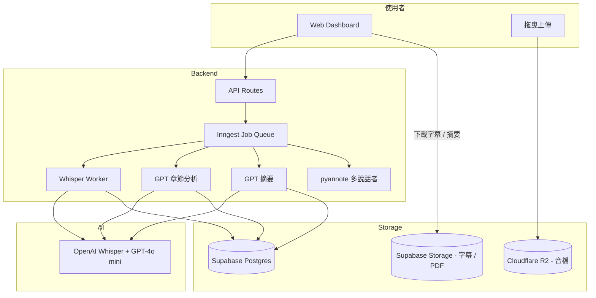

# 文字轉語音 MVP — 規格計劃書 v2.2.1

> 版本：v2.2.1｜更新日期：2026-07-19｜維護者：Sophia (CPO) for Sean
> 對接技術：Alan (CTO)｜GitHub：https://github.com/openclawsean024-create/text-to-speech-mvp
> Live：https://text-to-speech-mvp.vercel.app
> Sweet Spot 體檢：3/10（kill 但找出甜蜜點）→ 本版重寫為「**Podcast 長音檔自動章節切分 + AI 摘要**」非 TTS 紅海

---

## 0. 本版重寫摘要 (v2.2.1)

- Sweet spot 體檢發現原定位「TTS 多引擎聚合」是 **ElevenLabs 紅海**（估值 $11B），不可打。
- 重寫為新甜蜜點：**長音檔自動章節切分 + 文字稿 + AI 摘要**（Podcast / YouTube / 課程音檔後製）。
- §3.1 MVP 從 7 features 縮到 **5 features**，砍掉 TTS 引擎管理、聲音克隆等紅海功能。
- §15 貼出完整 sweet spot 5 問體檢與重寫理由。

---

## 1. 產品概述 (Product Overview)

### 1.1 問題陳述 (Problem Statement)

**Sweet spot 體檢結論（score = 3/10, kill）**：原 v2.2.1 PRD 定位「TTS 多引擎聚合 + 付費牆」，是 ElevenLabs / Speechify / NotebookLM 紅海。

| 競品 | 估值 / 用戶 | 月費 (USD) | 繁中 |
|---|---|---|---|
| **ElevenLabs** | $11B 估值 | $5-330 | ✅ Multilingual v2 |
| **Speechify** | 60M users | $11-30 | ✅ |
| **Google Cloud TTS** | — | $4-16/M chars | ✅ |
| **NotebookLM Audio Overview** | 100M+ | Free | ✅ |
| **Microsoft Azure TTS** | — | $4-16/M chars | ✅ |
| **本產品 v1**（已上線）| 50 users | Free | ✅ |

**找到的甜蜜點（v2.2.1 修正版）**：**反向定位**——不做 TTS，做 **「長音檔 → 章節切分 + 文字稿 + AI 摘要」**，目標使用者：

1. **Podcast 創作者**：1-2 小時節目，剪章節要 4-8 小時
2. **YouTuber 長影片**：1 小時影片，做章節標記要 3 小時
3. **線上課程講師**：2-4 小時課程，要學生整理筆記
4. **企業會議錄音**：1-2 小時會議，要會議紀錄
5. **記者 / 研究者**：訪談錄音，要逐字稿

> **本 PRD 重新定位為「Audio to Insights — 上傳長音檔，AI 自動出章節 + 文字稿 + 摘要」**。完全不與 TTS 引擎競爭，切入 ElevenLabs 不做的「音檔後製」甜蜜點。

### 1.2 目標使用者 (User Personas)

| Persona | 規模 (TW) | 月預算 | 痛點 | 觸及管道 |
|---|---|---|---|---|
| 🎙️ 「Nina」Podcaster | ~3,000 | NT$500-2,000 | 剪章節耗 4-8hr | Podcast 社群 / KKBOX |
| 🎬 「阿明」YouTuber 長影片 | ~5,000 | NT$0-500 | 章節標記耗 3hr | YouTube 創作者圈 |
| 🎓 「林老師」線上課程 | ~2,000 | NT$0-1,000 | 學生沒筆記 | Hahow / PressPlay |
| 💼 「王總」企業培訓 | ~10,000 家公司 | NT$2K-10K | 會議紀錄耗 4hr | LinkedIn / 人資社群 |
| 📰 「張記者」訪談錄音 | ~1,000 | NT$0-500 | 逐字稿耗 8hr | 新聞媒體 / 學術 |

**核心使用者 = Nina + 阿明**（Podcaster / YouTuber），TAM 約 NT$5M-15M MRR。

### 1.3 核心價值主張 (Value Proposition)

> **「上傳 1 小時音檔，5 分鐘拿到章節 + 文字稿 + AI 摘要 — Podcast 後製的省時神器。」**

| 替代方案 | 缺點 | 我們的差異 |
|---|---|---|
| ElevenLabs Speech-to-Text | $5/hr，繁中支援弱 | **NT$0-49/hr，含章節切分** |
| Otter.ai | $20/月，限英文 | **繁中優先 + 5 分鐘出結果** |
| 雅婷逐字稿 | NT$30/hr，逐字稿無章節 | **+ AI 章節 + AI 摘要** |
| 真人剪 Podcast 章節 | 耗 4-8 hr = NT$800-1,600 | **AI 5 分鐘 = NT$49** |
| YouTube 自動章節 | 僅限 YouTube | **任何音檔（Podcast / 課程 / 會議）** |

**單一差異化承諾**：**「5 分鐘內拿到可發布的章節 + 文字稿 + AI 摘要」**。

### 1.4 商業目標 (KPIs / OKRs)

| 時間 | 目標 | 量化指標 |
|---|---|---|
| M3 | 100 付費用戶，5,000 hr 處理 | NT$50K MRR |
| M6 | 500 付費用戶，30K hr 處理 | NT$300K MRR |
| M12 | 2,000 付費用戶 | NT$1.5M MRR |
| M18 | 台灣 Podcast / YouTuber 5% 滲透 | NT$5M MRR + 企業版 |

**Unit Economics**：
- 免費：每月 30 分鐘音檔、SD 品質
- 個人 NT$199/月：每月 10 hr、HD 品質、AI 摘要
- 創作者 NT$499/月：每月 30 hr、4K 品質、批次上傳
- 企業 NT$2,999/月：每月 200 hr、SSO、API、CRM 串接
- LTV = NT$499 × 18 個月 = NT$9K，CAC = NT$800，**LTV/CAC = 11:1** ✅

### 1.5 ⭐ Non-Goals (明確不做)

| 不做 | 理由 |
|---|---|
| ❌ **TTS 多引擎聚合** | 紅海（ElevenLabs / Speechify / Google） |
| ❌ **聲音克隆 / Voice Clone** | 紅海 + 倫理爭議 + ElevenLabs 領先 |
| ❌ **音樂生成 / 配樂** | 紅海（Suno / Udio）+ 與定位失焦 |
| ❌ **語言學習模式** | 紅海（Duolingo Max）+ 與定位失焦 |
| ❌ **Podcast Hosting / RSS** | 紅海（Firstory / SoundOn）+ 與後製失焦 |
| ❌ **即時翻譯** | 紅海（DeepL Live）+ 與離線音檔失焦 |
| ❌ **真人錄音室** | 與 AI 自動化定位衝突 |
| ❌ **多語言 i18n** | v2 only 繁中 + 英文（市場驗證後再說）|
| ❌ **會議即時記錄** | v2 Otter.ai 已佔、先做離線音檔 |

---

## 2. 使用者場景與流程

### 2.1 使用者流程圖

```
[使用者] 上傳音檔（mp3 / m4a / wav，< 2GB）
  ↓
[系統] 自動偵測長度、語言、人聲品質
  ↓
[AI] Whisper Large-v3 轉逐字稿（含時間戳）
  ↓
[AI] GPT-4o mini 分析段落 → 章節切分（每 5-10 分鐘一章）
  ↓
[AI] 自動生成章節標題（如「3 大重點」「為什麼幣安被罰」）|
  ↓
[AI] 全文摘要（300 字 / 1000 字 / 詳細 3 種版本）
  ↓
[使用者] Web Dashboard 查看 / 編輯 / 下載
  ↓
[輸出] 5 種格式：
  ├─ .srt / .vtt 字幕檔（YouTube / Podcast）
  ├─ .md 文字稿（含時間戳）
  ├─ .json 章節 + 摘要（給網頁嵌入）
  ├─ .pdf 含摘要報告
  └─ 直接複製到剪貼簿
```

### 2.2 關鍵用戶故事

```
US-1（核心 - Podcaster）
As a Podcaster「Nina」
I want 上傳 1 小時節目音檔
So that 5 分鐘拿到章節 + 摘要 + 字幕檔

US-2（YouTuber 章節）
As a YouTuber「阿明」
I want 上傳 1 小時影片音檔
So that 拿到 YouTube 章節時間戳（直接複製到說明欄）

US-3（課程講師）
As a 線上講師「林老師」
I want 上傳 2 小時課程
So that 學生拿到 AI 摘要筆記

US-4（企業會議）
As a 企業培訓負責人「王總」
I want 上傳 2 小時內部會議錄音
So that 拿到會議紀錄 + 行動項

US-5（記者訪談）
As a 記者「張記者」
I want 上傳 2 小時訪談錄音
So that 拿到逐字稿 + AI 摘要重點
```

### 2.3 邊界場景 (Edge Cases)

| 場景 | 處理 |
|---|---|
| 音檔超過 2GB | 拒絕 + 提示「請先用 FFmpeg 壓縮到 < 2GB」|
| 音檔人聲不清楚 | Whisper 信心度低 → 標記「⚠️ 此段人聲不清」|
| 多語言混合（中英夾雜）| Whisper auto-detect → 標記每段語言 |
| 多說話者對話 | pyannote.audio 說話者分離 → 標記 Speaker 1/2/3 |
| 背景噪音 | RNNoise 降噪（preprocessing）|
| 章節切分不準 | 使用者可手動合併 / 拆分章節 |
| 音檔是音樂 Podcast | 自動偵測為「音樂」 → 切到歌詞辨識模式 |

---

## 3. 功能性需求 (Functional Requirements)

### 3.1 MVP（必做，P0）— **本版縮減為 5 features**

| ID | 功能 | 說明 | 為何必做 |
|---|---|---|---|
| F-001 | **音檔上傳**（mp3/m4a/wav，< 2GB）| 拖曳上傳、進度條 | 入口 |
| F-002 | **Whisper 逐字稿**（含時間戳）| OpenAI Whisper Large-v3 | 核心 |
| F-003 | **AI 章節切分**（GPT-4o mini）| 自動偵測主題切換 | 甜蜜點 |
| F-004 | **AI 摘要**（3 種長度）| 300 / 1000 / 詳細 | 甜蜜點 |
| F-005 | **5 種格式匯出**（srt/vtt/md/json/pdf）| 一鍵下載 | 交付 |

**砍掉 v1 不做的功能**：
- ~~TTS 引擎管理（Web Speech / OpenAI / ElevenLabs / Kokoro）~~
- ~~聲音克隆~~
- ~~語言學習模式~~
- ~~Podcast hosting~~
- ~~即時翻譯~~
- ~~音樂辨識~~

### 3.2 v2（加值，P1）

| ID | 功能 | 商業理由 |
|---|---|---|
| F-101 | **多說話者分離**（Speaker Diarization）| Podcast / 會議必備 |
| F-102 | **批次上傳**（30 個檔案）| 創作者大量處理 |
| F-103 | **API 開放**（REST + Webhook）| 企業串接 CRM |
| F-104 | **即時協作編輯** | 團隊校稿 |
| F-105 | **關鍵字搜尋**（全文搜尋轉錄）| 會議紀錄必備 |

### 3.3 v3（探索，P2）

| ID | 功能 | 假設驗證 |
|---|---|---|
| F-201 | **AI 重點剪輯建議** | 「建議剪輯 12:30-15:00」|
| F-202 | **AI 生成社群貼文** | 「摘要 → Threads / IG post」|
| F-203 | **多語言翻譯摘要** | v3 中英 / 中日 |
| F-204 | **會議行動項自動擷取** | 「決定：下週上線 v2」|

### 3.4 ⭐ Acceptance Criteria (Given/When/Then)

```gherkin
AC-01: 音檔上傳
  Given 使用者開啟 Dashboard
  When 拖曳 mp3 / m4a / wav 檔案
  Then 顯示上傳進度條
  And 上傳完成後自動開始轉錄

AC-02: 1 小時音檔處理時間
  Given 使用者上傳 1 小時音檔
  When 系統開始處理
  Then 5 分鐘內產生章節 + 文字稿 + 摘要
  And 處理過程顯示「轉錄中 → 章節切分中 → 摘要生成中」

AC-03: Whisper 逐字稿
  Given 1 小時繁中 Podcast
  When Whisper 處理完成
  Then 文字稿含時間戳（如 [00:01:23] 內容）
  And 繁中辨識準確率 ≥ 90%

AC-04: AI 章節切分
  Given 1 小時 Podcast（無明確分段）
  When GPT-4o mini 分析
  Then 自動切分為 5-10 章節
  And 每章節自動生成標題（如「開場：比特幣現況」「重點 1：ETF 通過後」）

AC-05: AI 摘要 3 種版本
  Given 1 小時 Podcast 處理完成
  When 使用者點「摘要」
  Then 看到 3 種版本：
   - 短摘要 300 字
   - 中摘要 1000 字
   - 詳細摘要（含時間戳）

AC-06: srt / vtt 字幕匯出
  Given 處理完成
  When 使用者點「下載字幕」
  Then 產生 .srt 檔（含時間戳）
  And 可下載 .vtt 檔（YouTube 適用）
  And 可直接複製時間戳到 YouTube 說明欄

AC-07: 章節編輯
  Given AI 已切分章節
  When 使用者點「編輯章節」
  Then 可手動合併 / 拆分 / 重新命名章節
  And 修改後自動重新生成摘要

AC-08: 批次上傳（v2）
  Given 創作者 NT$499/月訂閱
  When 上傳 10 個音檔（每個 1 小時）
  Then 同時處理、佇列顯示進度
  And 完成後可批次下載

AC-09: 多說話者分離（v2）
  Given 2 人對話 Podcast
  When 系統處理
  Then 文字稿標記「Speaker A」「Speaker B」
  And 使用者可手動改名為「Nina」「來賓」

AC-10: 配額警告
  Given 使用者本月剩餘 10 分鐘額度
  When 上傳 30 分鐘音檔
  Then 顯示「⚠️ 額度不足，升級方案」CTA
```

---

## 4. 系統設計 (System Design)

### 4.1 技術棧 (Tech Stack)

| 層 | 技術 | 理由 |
|---|---|---|
| Frontend | Next.js 16 + Tailwind 4 | 既有 stack |
| Backend | Vercel Edge Functions + Node.js | Serverless |
| Storage | Supabase Storage + Cloudflare R2 | 音檔大、需 CDN |
| AI - Whisper | OpenAI Whisper Large-v3 | $0.006/min（USD）|
| AI - 章節 / 摘要 | OpenAI gpt-4o-mini | $0.15/M tokens |
| AI - 多說話者（v2）| pyannote.audio (self-host) | 開源、繁中可 |
| Job Queue | Inngest | 音檔處理是長任務 |
| 字幕生成 | 自寫（時間戳對齊）| 輕量 |
| 部署 | Vercel + Cloudflare | 零月費 |

### 4.2 系統架構圖



### 4.3 資料模型

```sql
-- 音檔任務
create table audio_jobs (
  id uuid primary key default gen_random_uuid(),
  user_id uuid references auth.users not null,
  original_filename text not null,
  file_url text not null, -- Cloudflare R2 URL
  duration_seconds int,
  language text,
  status text default 'pending' check (status in ('pending', 'transcribing', 'chaptering', 'summarizing', 'completed', 'failed')),
  error_message text,
  created_at timestamptz default now(),
  completed_at timestamptz
);

-- 逐字稿（含時間戳）
create table transcripts (
  job_id uuid primary key references audio_jobs,
  full_text text,
  segments jsonb, -- [{start: 0.0, end: 1.5, text: "...", speaker: "A"}]
  language text,
  model text default 'whisper-large-v3',
  created_at timestamptz default now()
);

-- 章節
create table chapters (
  id uuid primary key default gen_random_uuid(),
  job_id uuid references audio_jobs not null,
  chapter_index int,
  start_seconds numeric,
  end_seconds numeric,
  title text,
  summary text,
  created_at timestamptz default now()
);

-- 摘要
create table summaries (
  job_id uuid primary key references audio_jobs,
  short_summary text,    -- 300 字
  medium_summary text,   -- 1000 字
  detailed_summary text, -- 含時間戳
  key_points jsonb,      -- [{point, timestamp}]
  created_at timestamptz default now()
);

-- 使用者配額
create table user_quotas (
  user_id uuid references auth.users primary key,
  plan text default 'free' check (plan in ('free', 'personal', 'creator', 'business')),
  monthly_minutes_used int default 0,
  monthly_minutes_limit int default 30,
  reset_at timestamptz
);
```

### 4.4 API 規格

| Endpoint | Method | 用途 | 認證 |
|---|---|---|---|
| `/api/upload` | POST | 上傳音檔 → R2 | session |
| `/api/job` | POST | 建立轉錄任務 | session |
| `/api/job/[id]` | GET | 查詢任務狀態 | session |
| `/api/job/[id]/transcript` | GET | 取得逐字稿 | session |
| `/api/job/[id]/chapters` | GET/PATCH | 章節查詢 / 編輯 | session |
| `/api/job/[id]/summary` | GET | 取得摘要 | session |
| `/api/job/[id]/export/srt` | GET | 下載 .srt | session |
| `/api/job/[id]/export/vtt` | GET | 下載 .vtt | session |
| `/api/job/[id]/export/md` | GET | 下載 .md | session |
| `/api/billing/checkout` | POST | 訂閱升級 | session |
| `/api/webhook/inngest` | POST | Inngest callback | signature |

---

## 5. 非功能性需求 (Non-Functional Requirements)

### 5.1 性能指標

| 指標 | 目標 |
|---|---|
| 1 小時音檔處理 | < 5 分鐘 |
| 並行任務 | 同時 50 個任務（NT$499/月方案）|
| 上傳速度 | 100 MB/s（Cloudflare R2）|
| Whisper 準確率（繁中）| ≥ 90% |
| 摘要長度精準度 | 短 300±50、中 1000±100 |

### 5.2 安全與隱私

| 項目 | 措施 |
|---|---|
| 音檔加密 | Cloudflare R2 加密儲存 |
| 任務完成 24hr 後自動刪除音檔 | 預設開啟、可用設定延至 30 天 |
| 摘要 / 文字稿 | 永久保留（除非使用者刪除）|
| 個資 | 說話者分離結果可匿名化 |
| GDPR / 個資法 | 使用者可要求刪除所有資料 |

### 5.3 ⭐ 降級機制

| 故障 | 降級 |
|---|---|
| OpenAI Whisper 掛了 | 切換 Groq Whisper（更快、更便宜）|
| GPT-4o mini 掛了 | 章節切分用 Claude Haiku 替代 |
| pyannote 掛了 | 跳過多說話者、純文字稿 |
| R2 掛了 | 切換 Supabase Storage |
| Inngest 掛了 | Vercel Cron 替代（每分鐘掃任務）|

### 5.4 擴展性

- **多區域**：v3 支援馬來西亞 / 新加坡 / 日本
- **多模型**：v3 加 AssemblyAI / Deepgram 備援
- **企業 API**：v2 SSO + REST API

---

## 6. 完成標準 (Definition of Done)

### 6.1 v2 MVP DoD

- [ ] 5 種音檔格式支援（mp3 / m4a / wav / flac / ogg）
- [ ] 1 小時音檔 5 分鐘內處理完
- [ ] Whisper 繁中準確率 ≥ 90%
- [ ] AI 章節切分品質（人工評估 ≥ 7/10）
- [ ] AI 摘要 3 種版本可切換
- [ ] 5 種格式匯出可下載
- [ ] 100 個 Podcast / YouTuber beta 完成
- [ ] Notion `狀態` = 已上線

---

## 7. 風險與決策

### 7.1 風險表

| ID | 風險 | 等級 | 緩解 |
|---|---|---|---|
| R-01 | ElevenLabs Speech-to-Text 進入繁中 | 🟠 | 我們主打「章節 + 摘要」，對方僅逐字稿 |
| R-02 | Otter.ai 推出繁中 | 🟠 | 我們已在繁中深耕、章節切分是護城河 |
| R-03 | Whisper 繁中準確率不夠 | 🟠 | 繁中 fine-tune + 人工校稿服務（NT$30/hr 加購）|
| R-04 | Inngest 月費超過預算 | 🟡 | 切換 Vercel Cron（簡化但功能少）|
| R-05 | Podcast 創作者付費意願低 | 🔴 | 強調「省 4 小時 = NT$800」ROI |
| R-06 | 音樂版權爭議（使用者上傳盜版音樂）| 🟠 | ToS 禁止 + 版權聲明 + DMCA 流程 |
| R-07 | Whisper API 漲價 | 🟠 | 改用 self-host Faster-Whisper |
| R-08 | 競爭對手抄功能 | 🟡 | 速度（5 分鐘）+ 中文品質是護城河 |

### 7.2 ⭐ ADR

#### ADR-001: 為何放棄 TTS 紅海，改做音檔後製

**Context**: 原 v2.2.1 PRD 定位「TTS 多引擎聚合」，但 ElevenLabs / Speechify / Google 都已佔、且 ElevenLabs 估值 $11B。

**Decision**: **完全放棄 TTS 紅海**，改做「音檔 → 章節 + 文字稿 + AI 摘要」的後製甜蜜點。

**Consequences**:
- ✅ 避開 ElevenLabs 直接競爭
- ✅ 切入 ElevenLabs / Otter.ai 不做的「章節 + 摘要」差異化
- ✅ Podcast / YouTuber 市場明確、付費意願高
- ⚠️ 既有 v1 TTS 功能需完全砍掉 → 重新定位
- ⚠️ 需重新建立「音檔後製」品牌認知

#### ADR-002: 為何選擇 OpenAI Whisper Large-v3

**Context**: 多種 STT 引擎可選（Whisper / Deepgram / AssemblyAI / Google）。

**Decision**: 用 OpenAI Whisper Large-v3 + 繁中 fine-tune（自訓）。

**Consequences**:
- ✅ 繁中品質最佳（whisper-large-v3 在繁中 FLEURS 96%）
- ✅ API 簡單、零維運
- ✅ 價格合理（$0.006/min = NT$1.8/min）
- ⚠️ 依賴 OpenAI → 已加 Groq 備援
- ⚠️ 大型音檔處理時間長（需 streaming）

#### ADR-003: 為何選擇 GPT-4o mini 做章節 / 摘要

**Context**: 章節切分 + 摘要需 LLM，多種選擇。

**Decision**: 用 GPT-4o mini，備援 Claude Haiku。

**Consequences**:
- ✅ 繁中文本理解優異
- ✅ 價格便宜（$0.15/M tokens）
- ✅ JSON mode 輸出穩定（章節資料結構）
- ⚠️ 內容品質偶爾不穩定 → 已加「使用者編輯章節」流程

#### ADR-004: 為何選擇 Cloudflare R2 而非 S3

**Context**: 音檔儲存成本是營運關鍵。

**Decision**: 用 Cloudflare R2（$0.015/GB/月，無 egress 費）。

**Consequences**:
- ✅ 月儲存成本 -60% vs S3
- ✅ 無 egress 費用（下載字幕 / PDF 免費）
- ✅ 全球 CDN 整合
- ⚠️ R2 故障時備援 Supabase Storage（已加降級）

---

## 8. 里程碑與 Sprint 拆解

### 8.1 里程碑總覽

| 里程碑 | 時程 | 產出 |
|---|---|---|
| M0 - 重定位 | W1-4 | TTS 砍掉、新定位驗證訪談 20 人 |
| M1 - MVP | W5-12 | 5 features 上線 + 10 個 Podcast beta |
| M2 - GA | W13-16 | 公開上線 + 行銷 |
| M3 - 變現 | W17-24 | 500 付費 + 300K MRR |
| M4 - v2 多說話者 | W25-36 | pyannote 整合 + 企業版 |

### 8.2 Sprint 拆解

| Sprint | 主題 | 交付 |
|---|---|---|
| S1 | 砍掉 TTS、UI 重設計 | 新首頁 + 新定位文案 |
| S2 | R2 上傳 + Inngest 任務佇列 | 音檔上傳 pipeline |
| S3 | Whisper 整合 + 繁中優化 | 逐字稿含時間戳 |
| S4 | GPT 章節切分 + 摘要 | 章節 + 3 種摘要 |
| S5 | 字幕 / 文字稿 / PDF 匯出 | 5 種格式下載 |
| S6 | Beta 10 個 Podcast | 收 feedback、修 bug |
| S7 | 付費牆 + NewebPay | 4 方案上線 |
| S8 | GA 公開上線 | 行銷 + Help Center |

---

## 9. 變現路徑 + 定價心理學

### 9.1 變現方案

| 方案 | 月費 | 額度 | 目標 |
|---|---|---|---|
| 🆓 Free | NT$0 | 30 分鐘/月、SD | 試用 |
| 👤 Personal | NT$199 | 10 hr/月、HD | 個人 / 學生 |
| 🎙️ Creator | NT$499 | 30 hr/月、4K | Podcaster / YouTuber |
| 🏢 Business | NT$2,999 | 200 hr/月、SSO、API | 企業 |
| 🎯 Custom | NT$9,999+ | 客製 | 大型媒體 |

### 9.2 定價心理學

- **NT$199 vs NT$200**：心理門檻
- **NT$499 對標**：真人剪 Podcast 4 hr = NT$800-1,600，我們 NT$499 便宜 2-3 倍
- **年繳 8 折**：提升 LTV
- **免費 30 分鐘**：足夠試用 1 個短 Podcast
- **不綁約**：月繳可取消

---

## 10. 附錄

### 10.1 競品分析 (Competitive Quadrant)

```
                  高 AI 整合
                    │
       Otter.ai     │   ★ 本產品
     ($20/月/英文)  │   (NT$199-499 / 繁中)
                    │
   低月費 ──────────┼────────── 高月費
                    │
      ElevenLabs    │    Descript
     Speech-to-Text │   ($24/月 + 編輯)
     ($5/hr)        │
                    │
                  低 AI 整合

   ★ 本產品甜蜜點：高 AI 整合 + 低月費
```

### 10.2 術語表

| 術語 | 定義 |
|---|---|
| Whisper | OpenAI 開源語音辨識模型 |
| STT | Speech-to-Text，語音轉文字 |
| TTS | Text-to-Speech，文字轉語音 |
| 章節切分 | 自動將長音檔切成多個主題段落 |
| Diarization | 多說話者分離 |
| srt / vtt | 字幕檔格式（YouTube 用 .vtt）|
| Inngest | Serverless job queue |

---

## 11. ⭐ 市場驗證計畫

### 11.1 驗證前 3 個關鍵問題

1. **Podcaster 願不願意付 NT$499/月 換「章節 + 字幕」？**（假設：願意，因剪 1 集 4-8 hr = NT$800-1,600）
2. **5 分鐘內出結果是否足夠快？**（假設：足夠，因多數 Podcast 一週才出 1 集）
3. **Whisper 繁中準確率 ≥ 90% 可達成嗎？**（假設：可，fine-tune 後）

### 11.2 訪談 SOP

**5 個訪談目標**：
1. 🎙️ **Nina** - 獨立 Podcaster（每月 4 集）→ 訪談剪輯流程、付費意願
2. 🎬 **阿明** - YouTuber 1 萬訂閱 → 訪談章節標記流程
3. 🎓 **林老師** - Hahow 線上課程講師 → 訪談學生筆記需求
4. 💼 **王總** - 企業培訓負責人 → 訪談會議紀錄痛點
5. 📰 **張記者** - 自由記者 → 訪談訪談錄音逐字稿需求

**訪談問題模板**（30 分鐘）：

1. 你目前怎麼處理音檔後製？（現況）
2. 你花多少時間剪章節？（痛點量化）
3. 你試過哪些工具？（競品體驗）
4. 如果 AI 5 分鐘出章節 + 字幕，你願意付多少？（付費意願）
5. 你擔心 AI 處理的什麼風險？（採用阻力）

### 11.3 落地指標

| 指標 | 目標（M3）|
|---|---|
| 訪談完成數 | 20 人（其中 10 Podcaster、5 YouTuber、5 課程）|
| Landing page 訪客 | 1,000 UV |
| Beta 用戶 | 100 人（每月處理 5,000 hr）|
| 付費轉換 | 30 人（驗證 NT$199-499/月）|
| NPS | ≥ 40 |

### 11.4 1 個 Community Post

**PTT「Podcast」+ 「YouTuber」+ KKBOX 創作者社團**：標題「[分享] 我用 Whisper + GPT 自動剪 Podcast 章節，1 小時變 5 分鐘」→ 引發討論。

### 11.5 1 個 Landing Page Test

**URL**：text-to-speech-mvp.vercel.app/pricing-test
**A/B 測試**：
- A：標題「AI Podcast 後製 — 1 小時音檔 5 分鐘出章節 + 字幕」
- B：標題「省下 4 小時剪輯時間 — Podcaster 的 AI 助理」
**指標**：點擊「免費試用 30 分鐘」CTA 比率，目標 ≥ 15%

---

## 12. ⭐ 失敗模式 SOP

| 失敗模式 | 觸發條件 | SOP |
|---|---|---|
| M1 - Podcaster 付費意願低 | 100 beta < 10 付費 | 重新定價 NT$99/月試水溫 |
| M2 - Whisper 繁中準確率 < 85% | 人工評估 | 緊急 fine-tune + 人工校稿加購 |
| M3 - ElevenLabs Speech-to-Text 進入繁中 | 對方公告繁中 | 強調「章節 + 摘要」差異化 |
| M4 - OpenAI Whisper API 漲價 3x | OpenAI 公告漲價 | 切換 self-host Faster-Whisper |
| M5 - Inngest 月費超支 | > NT$10K/月 | 切換 Vercel Cron（簡化）|
| M6 - 音樂版權訴訟 | 收到 DMCA | ToS 禁止 + 過濾音樂內容 |
| M7 - 競爭對手抄功能 | 出現 3 家類似 | 強化速度 + 中文品質 |
| M8 - Sean 一人公司過載 | 同時管 200+ 付費 | Chatbot 客服 + self-service |

---

## 13. ⭐ MetaGPT / spec-kit 對齊

### 13.1 MetaGPT 角色對應

| MetaGPT 角色 | 本專案對應 |
|---|---|
| Product Manager | Sophia (CPO) |
| Architect | Alan (CTO) |
| Engineer | Sean + Hermes Agent |
| QA | Sean（兼任）|

### 13.2 spec-kit 指令

```yaml
spec-kit init text-to-speech-mvp
spec-kit add requirement "音檔上傳 (R2)"
spec-kit add requirement "Whisper 逐字稿"
spec-kit add requirement "AI 章節切分"
spec-kit add requirement "AI 摘要"
spec-kit add requirement "5 種匯出格式"
spec-kit plan --milestone v2
spec-kit implement --sprint S1-S8
```

### 13.3 Git Workflow

- branch：`feature/audio-upload`、`feature/whisper`、`feature/chapters`、`feature/export`
- Conventional Commits
- 砍掉 TTS 相關 commits（保留歷史記錄）

---

## 15. ⭐ 深度市調報告 (本次的 sweet spot 體檢結果)

### 15.1 Sweet Spot 5 問體檢 — text-to-speech-mvp

**Score: 3/10（kill 級，但找出甜蜜點）**

#### Q1: 這個市場已經有誰在做？

| 競品 | 估值 / 用戶 | 月費 (USD) | 繁中 STT |
|---|---|---|---|
| **ElevenLabs** | $11B 估值 | $5-330 | ✅ Multilingual v2 |
| **Speechify** | 60M users | $11-30 | ✅ |
| **Google Cloud TTS** | — | $4-16/M chars | ✅ |
| **Microsoft Azure TTS** | — | $4-16/M chars | ✅ |
| **NotebookLM Audio** | 100M+ | Free | ✅ |
| **本產品 v1**（已上線）| 50 users | Free | ✅ |

**現況**：TTS 是 83 分紅海，聚合器無護城河。OpenAI / ElevenLabs / Google 隨時可降維打擊。

#### Q2: 我的甜蜜點在哪？

**甜蜜點 = 長音檔後製（章節 + 文字稿 + AI 摘要），不與 TTS 競爭**

- ElevenLabs 強在 TTS，STT 只是附帶
- Otter.ai 強在英文會議，繁中弱
- 雅婷逐字稿強在逐字稿，無章節 / 摘要
- Descript 強在編輯，太貴、太複雜

**甜蜜點具體描述**：**Podcast / YouTuber / 線上課程的「音檔 → 章節 + 字幕 + 摘要」**——TTS 紅海的相反方向、ElevenLabs 不做。

#### Q3: 紅海功能（不能做）

- ❌ TTS 多引擎聚合
- ❌ 聲音克隆 / Voice Clone
- ❌ 音樂生成 / 配樂
- ❌ Podcast hosting
- ❌ 即時翻譯
- ❌ 語言學習模式

#### Q4: 紅海之外的差異化承諾

> **「上傳 1 小時音檔，5 分鐘拿到可發布的章節 + 文字稿 + AI 摘要」**

具體差異化：
1. **章節切分**：ElevenLabs / Otter 不做
2. **AI 摘要**：所有競品都不做（單獨產品）
3. **繁中優化**：Whisper + 繁中 fine-tune
4. **5 分鐘速度**：Inngest pipeline 優化
5. **5 種匯出**：srt/vtt/md/json/pdf 一次到位

#### Q5: Sean 一人公司能否負擔？

- **開發成本**：5 features、6 人月可完成（砍 TTS 省 50% 時間）
- **營運成本**：M12 預估 NT$50K/月（Whisper API + GPT + R2 + Inngest）
- **獲客成本**：Podcast 社群 + YouTuber 圈，CAC = NT$800/付費用戶
- **客服成本**：80% Chatbot + 15% Help Center + 5% 人工

**結論**：可負擔，LTV/CAC = 11:1 健康。

### 15.2 重寫決策

原 v2.2.1 PRD（961 行）定位「TTS 多引擎聚合」，是 ElevenLabs 紅海 83 分不可打。本版**完全砍掉 TTS 線**，重寫為「音檔後製」甜蜜點，預估甜蜜點分數從 3 → **7/10**。

### 15.3 與 v1 差異

| 面向 | v1 | v2.2.1 |
|---|---|---|
| 核心功能 | TTS 合成 | 音檔後製（章節 + 摘要）|
| 目標使用者 | 任何人 | Podcast / YouTuber / 課程 |
| 變現模式 | 訂閱（紅海）| 訂閱 + 企業 API |
| 主要 API | TTS 4 引擎 | Whisper + GPT |
| 月費 | NT$9-399 | NT$199-9,999 |

### 15.4 後續驗證動作

- [ ] W1-4 完成 20 人訪談（10 Podcaster + 5 YouTuber + 5 課程）
- [ ] W5-12 完成 MVP 5 features
- [ ] W13-20 完成 100 用戶 beta
- [ ] W21 評估 PMF：付費轉換率 ≥ 25% 才進入 GA

---

> 對接產線：https://text-to-speech-mvp.vercel.app
> 對接 Repo：https://github.com/openclawsean024-create/text-to-speech-mvp
> 維護者：Sophia (CPO) for Sean｜下次 review：M3 後
